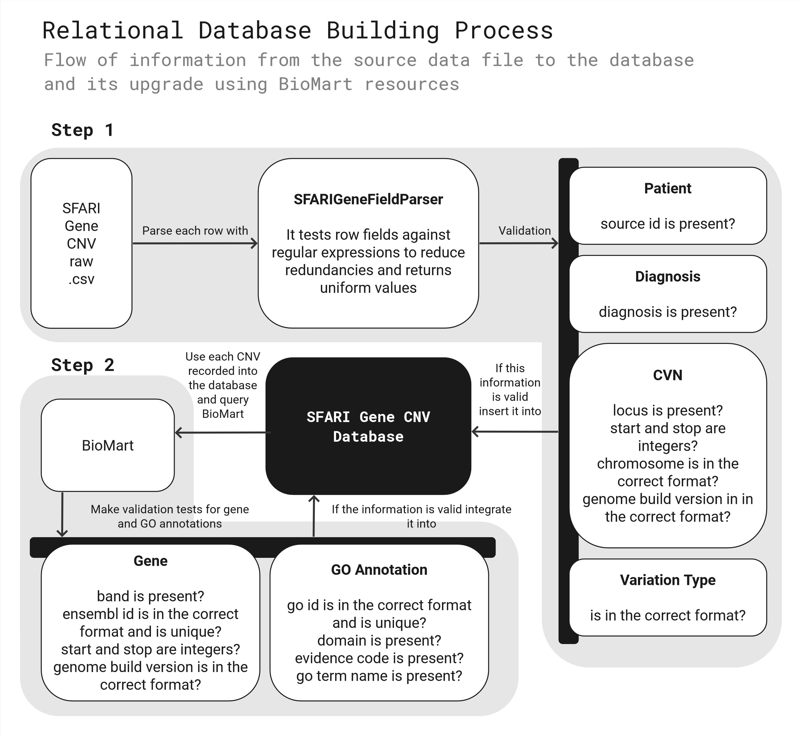
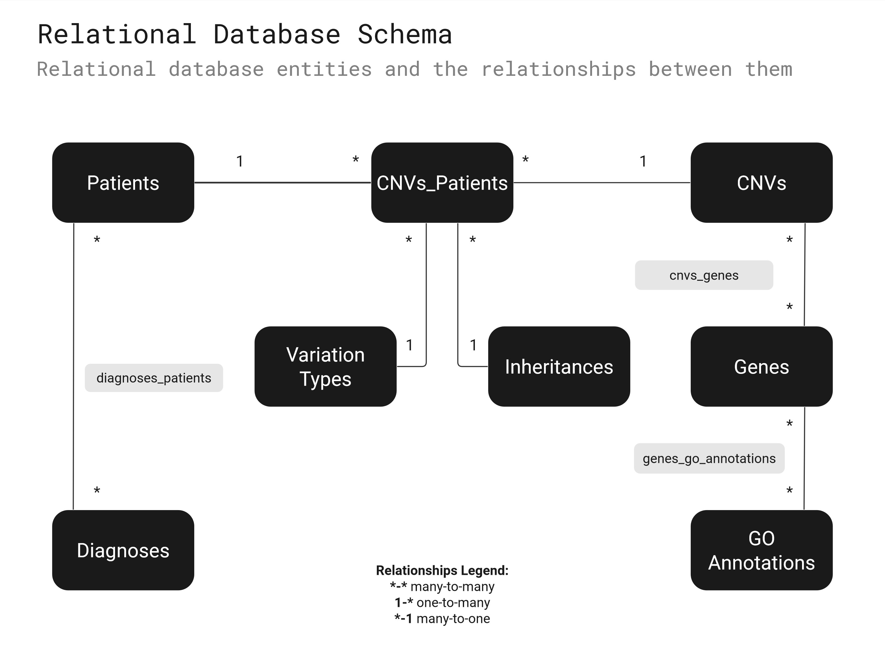
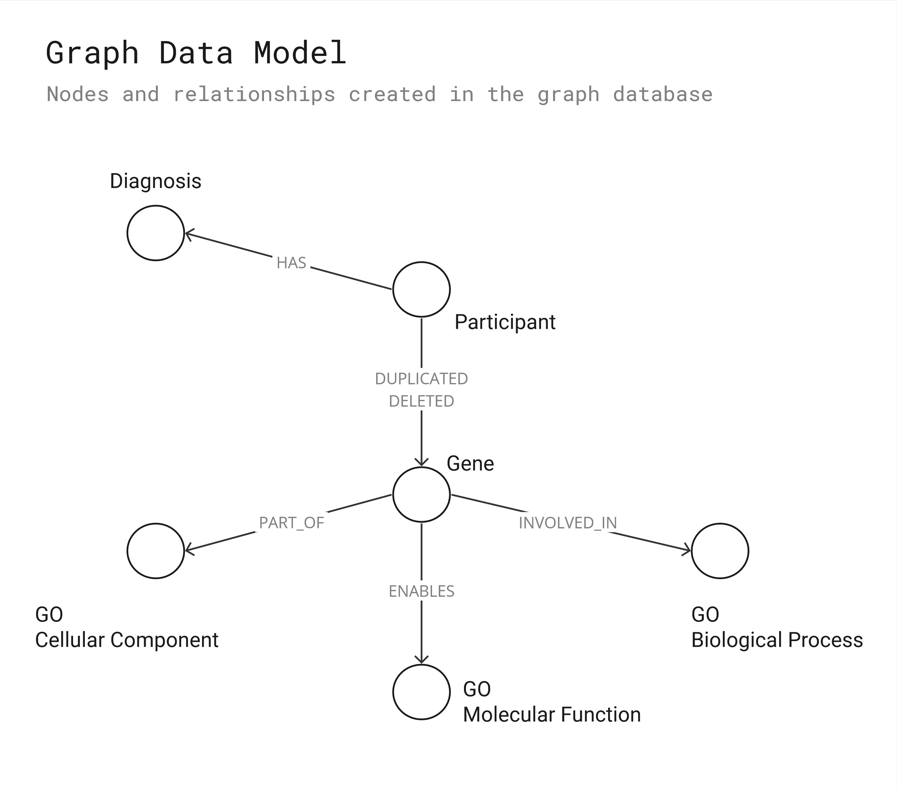
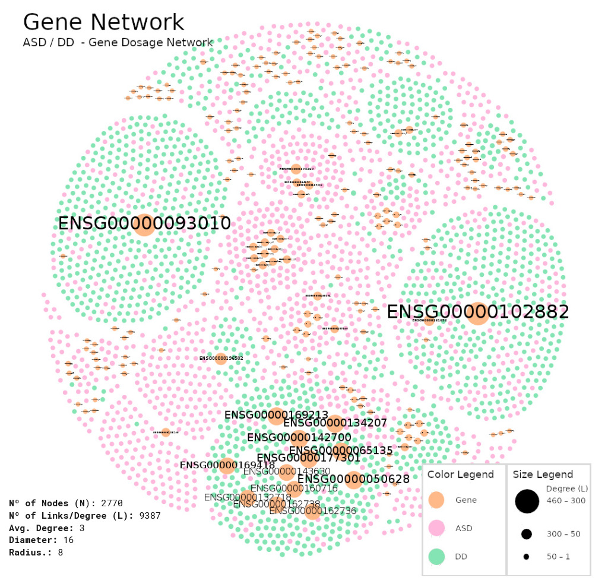
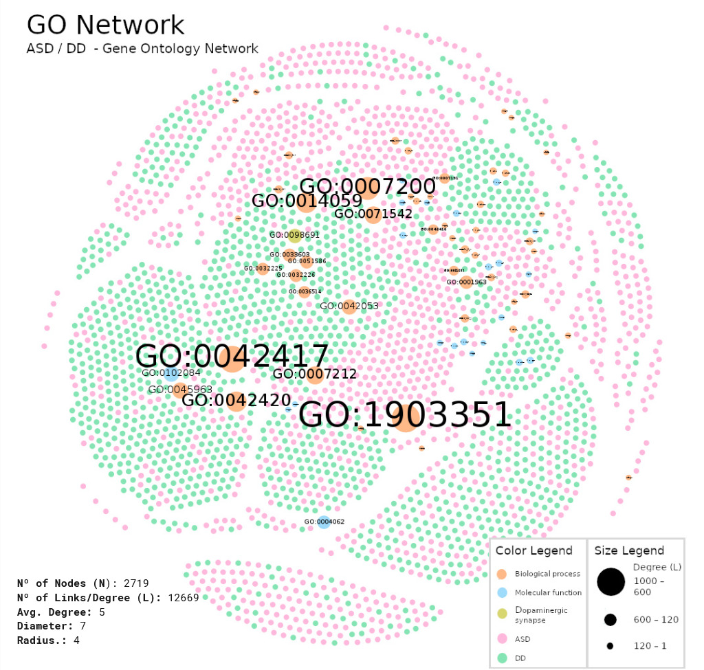

# Portfolio

## 1. About me

👋 Hi, I’m André Ferreira Santos 

**Biomedical Engineer | Data & AI Enthusiast | Transforming complexity into clarity with data, design & AI**  

I build standards-driven, user-centric tools that turn complex data into actionable insights.  
Currently pursuing a PhD in Biomedical Engineering (Univ. of Coimbra), applying **graph analytics & ML to autism genetics**, while expanding into **AI/LLM applications** for real-world impact.  

🌍 Passionate about open science, human-centric design, and digital transformation.  

---


## 2. Featured Projects 🚀

### PhD Project — From Copy Number Variations to Biological Networks 🧬

**Integrating relational databases, graph theory & machine learning to decode dopaminergic and serotonergic mechanisms in autism and developmental delay.**

#### From Unstructured Data to Relational and Graph Databases

*Relational and Graph Databases for Neurodevelopmental Genetics Using SFARI Gene CNV Data*

**Highlights:**
- Transformed raw SFARI CNV text files into **analysis-ready relational & graph databases**.
- Produced **+68k patient–CNV associations across +28k individuals**.
- Released as **open science resource** (800+ downloads) for reuse in genetic and network analyses.

<details>
<summary>📖 Read More</summary>

**Problem:**

Copy Number Variations (CNVs)—duplications or deletions of genomic regions—play a major role in neurodevelopmental disorders such as Autism Spectrum Disorder (ASD).  
Although SFARI Gene aggregates CNV data from global ASD studies, the resource is distributed as **unstructured, heterogeneous text files** with inconsistent terms and implicit inter-record relationships. This lack of standardization prevented **computational analysis, large-scale integration, and hypothesis generation**. 

**Solution:**

We designed a **structured ETL workflow** to transform SFARI CNV data into queryable and extensible databases:
1. **Relational database (MySQL):** Integrated harmonized CNV calls, participant metadata, and gene/GO annotations (via Ensembl Biomart).
2. **Graph database (Neo4j):** Encoded biological relationships (*gene ↔ diagnosis*, *CNV ↔ participant*) to enable network-based analytics.
3. **Data normalization & curation:** Regex-based harmonization of terms, genome build standardization (GRCh38/hg38), and **explicit schema design** to ensure scalability.


*Workflow for transforming raw CNV data into analysis-ready relational & graph databases.*


*Relational schema connecting patients, CNVs, diagnoses, genes, and annotations via many-to-many relationships.*


*Graph model showing patients, CNVs, genes, and diagnoses, enabling network-based analysis.*

**Impact:**

- Generated a **knowledge base of 68,811 patient–CNV associations** mapped across 28,717 individuals.
- Enabled **hypothesis generation** and efficient queries of patterns previously hidden in unstructured text.
- Created a **modular framework** extendable to external omics datasets (e.g., transcriptomics, proteomics).
- Contributed an **open science resource** used by the community (800+ downloads). 

**Tech Stack:**

`MySQL · Neo4j · Ensembl Biomart · Python, Ruby & R (regex, ETL scripts) · GRCh38/hg38 genome builds`

**Open Science:**  
All datasets and scripts are publicly available 👉 [Dataverse Repository](https://doi.org/10.7910/DVN/HO1JLJ)  

</details>

---

#### Dopaminergic Networks and Diagnosis Classification in Autism Spectrum Disorder and Developmental Delay

*Complex network analysis and machine learning for disentangling dopaminergic mechanisms in ASD and DD*

**Highlights:**
- Built **multi-layer networks** (genes, GO terms, participants) to study dopaminergic imbalance in ASD vs. DD.  
- Identified **four disrupted dopaminergic mechanisms** in ASD versus a more unified dopaminergic pattern in DD.  
- Achieved **85.2% classification accuracy** distinguishing ASD from DD using Random Forests (features: 117 genes / 62 GO terms).  
- Proposed a **biology-driven ontological feature space** that compactly generalizes across genetic variability.  

<details>
<summary>📖 Read More</summary>

**Problem:**  
The neurobiological underpinnings of autism spectrum disorder (ASD) remain unclear, partly due to its **phenotypic and genetic heterogeneity**. While dopaminergic dysfunction is a strong candidate mechanism, no framework existed for functionally comparing dopaminergic gene dosage effects in **ASD vs. Developmental Delay (DD)**.  

**Solution:**  
We applied **complex network analysis** to SFARI CNV datasets in order to capture dopaminergic disruptions:  
1. Constructed **Gene Dosage Networks** linking duplications/deletions of dopamine-related genes to participants.  
2. Built **GO-based Networks** (biological processes, molecular functions, cellular localization of the dopaminergic synapse).  
3. Analyzed hubs, modularity, and community structures to reveal disease-specific subnetworks.  
4. Trained **Random Forest models** on network-derived feature vectors to classify ASD vs. DD.

  
*Dopaminergic Gene Dosage Network.*

  
*Dopaminergic GO Network.*

  
*Workflow: feature extraction → feature selection → Random Forest classification.*  

**Impact:**  
- Found that **ASD networks fractionated into four distinct disrupted mechanisms** (receptor binding, dopamine metabolism, synaptic physiology, neuronal differentiation).  
- DD presented **a more unified low-modularity dopaminergic profile**, highlighting a key biological distinction from ASD.  
- Achieved **85.18% (±1.1%) accuracy** in classifying ASD vs. DD (test set: 790 individuals), surpassing prior genetics-only studies and nearing imaging-based approaches.  
- Demonstrated that only **62 GO-derived features** achieved similar performance to gene features, supporting the value of a **compact ontology-driven feature space**.  
- Advances the case for **knowledge-based machine learning pipelines** in neurodevelopmental diagnoses.  
 
**Tech Stack:**  
`MySQL · Ruby · Python · scikit-learn · R · NetworkX · Gephi `

**Publication:**  
Full peer-reviewed article published in *Journal of Personalized Medicine* (Special Issue: Systems Medicine and Bioinformatics).  
📄 [Dopaminergic Gene Dosage Reveals Distinct Biological Partitions between Autism and Developmental Delay as Revealed by Complex Network Analysis and Machine Learning Approaches](https://doi.org/10.3390/jpm12101579)   

</details>

---

#### Graph-Native Machine Learning for Node Classification with Participant Similarity Networks using Dopaminergic Features

**Problem:**
**Solution:**
**Impact:**
**Tech:**

---

#### Serotonergic Networks: Differentiating Autism and Developmental Delay

**Problem:**
**Solution:**
**Impact:**
**Tech:**

---

### CHUC Hospital — Digital Clinical Documentation 🏥

---

### CHUC Hospital - Integration of Clinical Documentation with National Healthcare System (SClínico) 📝

---

### COVMind — Remote CBT (Cognitive Behavioral Therapy)/Mindfulness Platform 🧘

---

### CIMAGO — Data Science & ML in Genetic Cancer Research 🧪

---

## 3. Exploration Projects 🤖

---

## 4. Publications 📚

- **Santos, A.**, Caramelo, F., Melo, J. B., & Castelo-Branco, M.  
  *Dopaminergic Gene Dosage Reveals Distinct Biological Partitions between Autism and Developmental Delay as Revealed by Complex Network Analysis and Machine Learning Approaches*.  
  **Journal of Personalized Medicine**, 12(10), 1579, 2022.  
  👉 [https://doi.org/10.3390/jpm12101579](https://doi.org/10.3390/jpm12101579)    

- **Santos, A.**, Caramelo, F., Melo, J. B., & Castelo-Branco, M.  
  *A relational database of SFARI Gene CNVs data integrated with associated genes and GO terms for the study of genetics in neurodevelopmental disorders*.  
  **Harvard Dataverse**, V1, 2022.  
  👉 [https://doi.org/10.7910/DVN/HO1JLJ](https://doi.org/10.7910/DVN/HO1JLJ)  


<details>
<summary>📑 Cite My Work (BibTeX)</summary>

```bibtex
@article{Santos2022Dopamine,
  author    = {Santos, André and Caramelo, Francisco and Melo, Joana Barbosa and Castelo-Branco, Miguel},
  title     = {Dopaminergic Gene Dosage Reveals Distinct Biological Partitions between Autism and Developmental Delay as Revealed by Complex Network Analysis and Machine Learning Approaches},
  journal   = {Journal of Personalized Medicine},
  year      = {2022},
  volume    = {12},
  number    = {10},
  pages     = {1579},
  doi       = {10.3390/jpm12101579},
  publisher = {MDPI}
}

@dataset{Santos2022Dataverse,
  author    = {Santos, André and Caramelo, Francisco and Melo, Joana Barbosa and Castelo-Branco, Miguel},
  title     = {A relational database of SFARI Gene CNVs data integrated with associated genes and GO terms for the study of genetics in neurodevelopmental disorders},
  year      = {2022},
  publisher = {Harvard Dataverse},
  version   = {V1},
  doi       = {10.7910/DVN/HO1JLJ},
  url       = {https://doi.org/10.7910/DVN/HO1JLJ}
}
```
</details>


---

## 5. Skills 🛠️

- **Languages & Frameworks:** Python, Elixir, R, SQL, ASP.NET MVC, Phoenix, Ruby, Ruby on Rails, Javascript, Java, HTML, CSS
- **AI/ML:** scikit-learn, Neo4j Graph Data Science   
- **Standards:** HL7-CDA, SNOMED-CT  
- **Data Tools:** MySQL, PostgreSQL, Neo4j, relational & graph database design  

---

## 6. Current Focus 🌱

---

## Let’s Connect 📫

- [LinkedIn](https://www.linkedin.com/in/andre-santos-407224205/)
- [Github](https://github.com/afs091/)
- afsantos091@gmail.com  