# Portfolio

## 1. About me

👋 Hi, I’m **André Ferreira Santos**  

**Health Informatics Specialist · Biomedical Engineer · Researcher in Translational Neuroinformatics**  
**Transforming complexity into clarity with data, design & AI**  

I build standards‑driven, user‑centric tools that turn complex data into actionable insights.  
**PhD in Biomedical Engineering** (University of Coimbra, 2026 — *Aprovado com Distinção e Louvor*), applying **graph analytics & machine learning to autism genetics**, while expanding into **LLM and AI applications** with real‑world clinical and research impact.  

🌍 **Passionate about open science, human‑centric design, and digital transformation.** 

---

🎓 **Professional Certifications & Training**
- 🧠 **Neo4j Certified Professional**, Neo4j Academy (2022)  
- 📊 **Google Data Analytics Professional Certificate**, Google (2022)  
- 🧩 **Neo4j Graph Data Science Certification**, Neo4j Academy (2024)  
- 💬 **Advanced English Proficiency** – Reading, Writing & Speaking  

🧘 **Personal Leadership & Well‑being Programs**
- **SKY Leadership & Teacher Training Course**, *The Art of Living Foundation* (2023 – 2024) — focused on emotional intelligence, communication and team leadership.  

---


## 2. Featured Projects 🚀

### 2.1. PhD Project — From Copy Number Variations to Biological Networks 🧬

**Integrating relational databases, graph theory & machine learning to decode dopaminergic and serotonergic mechanisms in autism and developmental delay.**

🎓 **PhD awarded, June 2026** — *Aprovado com Distinção e Louvor* (18.300/20), the highest grade in the Portuguese doctoral system. The thesis's best result — an **88.6% accuracy** classifying ASD vs. Developmental Delay from a combined dopaminergic + serotonergic network — surpasses DSM‑5 diagnostic sensitivity for children under 7 (78%) by **+8 percentage points**, using only genetic data already available from standard clinical microarray (CMA) workflows.

#### 2.1.1. From Unstructured Data to Relational and Graph Databases

*Relational and Graph Databases for Neurodevelopmental Genetics Using SFARI Gene CNV Data*

**Highlights:**
- Transformed raw SFARI CNV text files into **analysis-ready relational & graph databases**.
- Produced **+68k patient–CNV associations across +28k individuals**.
- Released as **open science resource** (1,300+ downloads) for reuse in genetic and network analyses.

<details>
<summary>📖 Read More</summary>

**Problem:**

Copy Number Variations (CNVs)—duplications or deletions of genomic regions—play a major role in neurodevelopmental disorders such as Autism Spectrum Disorder (ASD).  
Although SFARI Gene aggregates CNV data from global ASD studies, the resource is distributed as **unstructured, heterogeneous text files** with inconsistent terms and implicit inter-record relationships. This lack of standardization prevented **computational analysis, large-scale integration, and hypothesis generation**. 

**Solution:**

We designed a **structured ETL workflow** to transform SFARI CNV data into queryable and extensible databases:
1. **Relational database (MySQL):** Integrated harmonized CNV calls, participant metadata, and gene/GO annotations (via Ensembl Biomart).
2. **Graph database (Neo4j):** Encoded biological relationships (*gene ↔ diagnosis*, *CNV ↔ participant*) to enable network-based analytics.
3. **Data normalization & curation:** Regex-based harmonization of terms, genome build standardization (GRCh38/hg38), and **explicit schema design** to ensure scalability.

**Impact:**

- Generated a **knowledge base of 68,811 patient–CNV associations** mapped across 28,717 individuals.
- Enabled **hypothesis generation** and efficient queries of patterns previously hidden in unstructured text.
- Created a **modular framework** extendable to external omics datasets (e.g., transcriptomics, proteomics).
- Contributed an **open science resource** used by the community (1,300+ downloads). 

**Supporting Figures:**

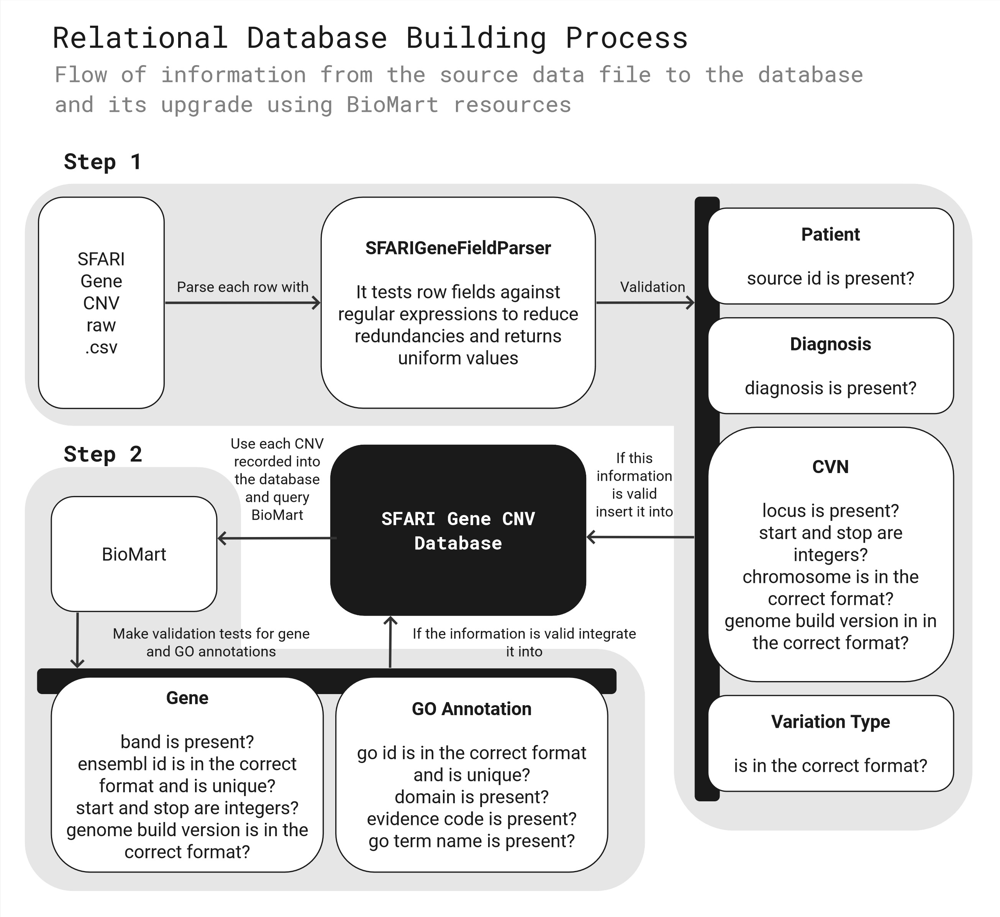
*Workflow for transforming raw CNV data into analysis-ready relational & graph databases.*

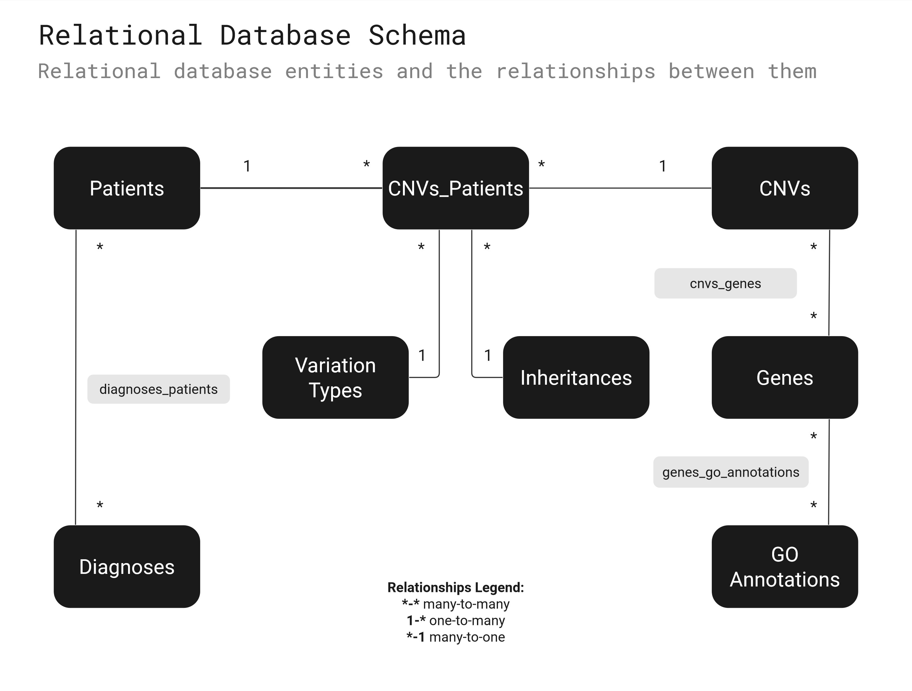
*Relational schema connecting patients, CNVs, diagnoses, genes, and annotations via many-to-many relationships.*

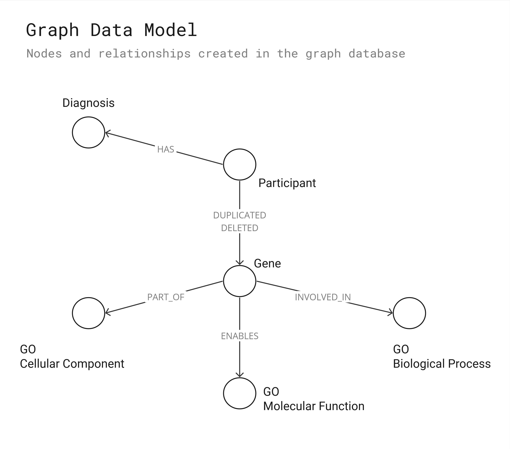
*Graph model showing patients, CNVs, genes, and diagnoses, enabling network-based analysis.*

**Tech Stack:**

`MySQL · Neo4j · Ensembl Biomart · Python, Ruby & R (regex, ETL scripts) · GRCh38/hg38 genome builds`

**Open Science:**  
All datasets and scripts are publicly available 👉 [Dataverse Repository](https://doi.org/10.7910/DVN/HO1JLJ)  

</details>

---

#### 2.1.2. Dopaminergic Networks and Diagnosis Classification in Autism Spectrum Disorder and Developmental Delay

*Complex network analysis and machine learning for disentangling dopaminergic mechanisms in ASD and DD*

**Highlights:**
- Built **multi-layer networks** (genes, GO terms, participants) to study dopaminergic imbalance in ASD vs. DD.  
- Identified **four disrupted dopaminergic mechanisms** in ASD versus a more unified dopaminergic pattern in DD.  
- Achieved **85.2% classification accuracy** distinguishing ASD from DD using Random Forests (features: 117 genes / 62 GO terms).  
- Proposed a **biology-driven ontological feature space** that compactly generalizes across genetic variability.  

<details>
<summary>📖 Read More</summary>

**Problem:**  
The neurobiological underpinnings of autism spectrum disorder (ASD) remain unclear, partly due to its **phenotypic and genetic heterogeneity**. While dopaminergic dysfunction is a strong candidate mechanism, no framework existed for functionally comparing dopaminergic gene dosage effects in **ASD vs. Developmental Delay (DD)**.  

**Solution:**  
We applied **complex network analysis** to SFARI CNV datasets in order to capture dopaminergic disruptions:  
1. Constructed **Gene Dosage Networks** linking duplications/deletions of dopamine-related genes to participants.  
2. Built **GO-based Networks** (biological processes, molecular functions, cellular localization of the dopaminergic synapse).  
3. Analyzed hubs, modularity, and community structures to reveal disease-specific subnetworks.  
4. Trained **Random Forest models** on network-derived feature vectors to classify ASD vs. DD.

**Impact:**  
- Found that **ASD networks fractionated into four distinct disrupted mechanisms** (receptor binding, dopamine metabolism, synaptic physiology, neuronal differentiation).  
- DD presented **a more unified low-modularity dopaminergic profile**, highlighting a key biological distinction from ASD.  
- Achieved **85.18% (±1.1%) accuracy** in classifying ASD vs. DD (test set: 790 individuals), surpassing prior genetics-only studies and nearing imaging-based approaches.  
- Demonstrated that only **62 GO-derived features** achieved similar performance to gene features, supporting the value of a **compact ontology-driven feature space**.  
- Advances the case for **knowledge-based machine learning pipelines** in neurodevelopmental diagnoses.  

**Supporting Figures:** 

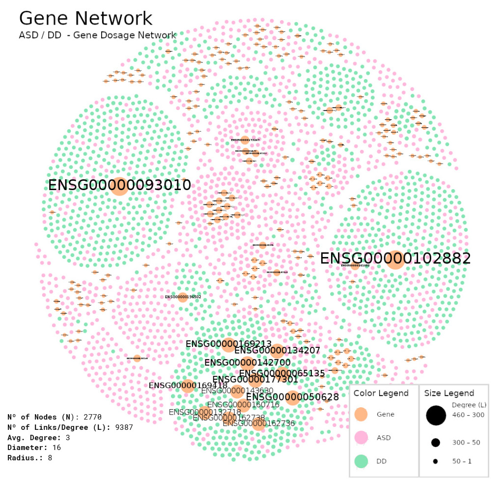  
*Dopaminergic Gene Dosage Network.*

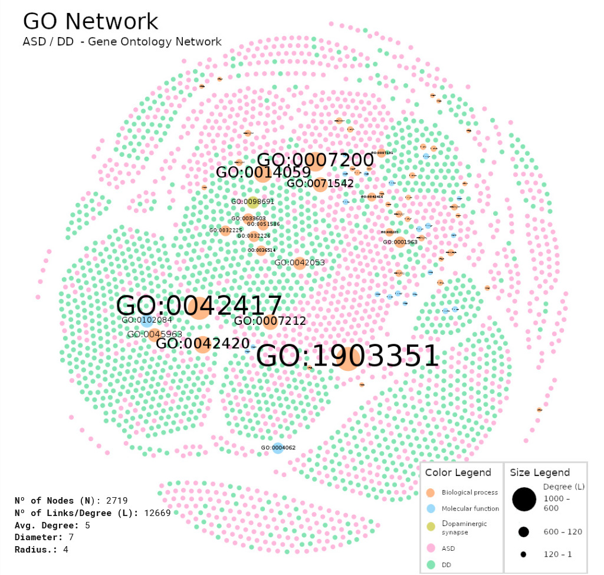  
*Dopaminergic GO Network.*

  
*Workflow: feature extraction → feature selection → Random Forest classification.* 

**Tech Stack:**  
`MySQL · Ruby · Python · scikit-learn · R · NetworkX · Gephi `

**Publication:**  
Full peer-reviewed article published in *Journal of Personalized Medicine* (Special Issue: Systems Medicine and Bioinformatics).  
📄 [Dopaminergic Gene Dosage Reveals Distinct Biological Partitions between Autism and Developmental Delay as Revealed by Complex Network Analysis and Machine Learning Approaches](https://doi.org/10.3390/jpm12101579)   

</details>

---

#### 2.1.3. Graph-Native Machine Learning for Node Classification with Participant Similarity Networks using Dopaminergic Features

*Using dopaminergic genetic similarity graphs to classify ASD vs. DD participants with graph-native ML*

**Highlights:**
- Built **participant similarity networks** (N=2343; ASD=1288, DD=1055) from dopaminergic CNVs + GO terms.  
- Constructed three graph types: **genetic similarity (gs)**, **GO-term similarity (gos)**, and **combined (ggos)**.  
- Demonstrated that **graph embedding features outperformed centrality metric features** for classification tasks.  
- Achieved **>84% accuracy** in ASD vs DD classification with embedding-based Random Forests.  
- Revealed **finer subgroup structures in ASD**, while GO terms grouped participants into broader communities.  

<details>
<summary>📖 Read More</summary>

**Problem:**  
ASD and DD are **multifactorial disorders** with **highly heterogeneous genetic and functional profiles**. Individual genetic variants contribute weakly, and shared clinical labels often mask divergent molecular mechanisms. Traditional ML treats participants as **independent datapoints**, missing the **networked relationships** that emerge from shared dopaminergic disruptions. A graph-native approach is needed to capture these relational patterns for better classification and subgroup discovery.  

**Solution:**  
- Constructed a **graph database** linking participants → dopamine genes → GO terms.  
- Computed pairwise participant similarity vectors based on gene and/or GO features.  
- Built three similarity networks: **gs, gos, ggos**.  
- Extracted node-level features via **centrality** & **graph embeddings (FastRP)**.  
- Trained **Random Forest classifiers** with 5-fold CV to predict ASD vs DD.  

**Impact:**  
- Showed that network representation strongly shapes participant clustering:  
  - **gs:** fragmented into 48 highly modular subgroups (fine-grained genetic signal).  
  - **gos:** only 8 broader communities (functional similarity).  
  - **ggos:** intermediate (12 modules; compact yet heterogeneous).  
- **Similarity trends:** ASD–ASD pairs most similar across all networks, DD/DD and ASD/DD weaker.  
- **Classification results:**  
  - Centrality features ~78–80% accuracy.  
  - Embedding features **>84% accuracy**, with ASD precision (88.7%) and DD recall (90.2%) strongest in gs network.  
  - Integration of genetic + functional features improved robustness and balance.  
- Paves the way for **multi-omics + clinical graph integration** in GNML pipelines for ASD diagnostics.

**Supporting Figures:** 

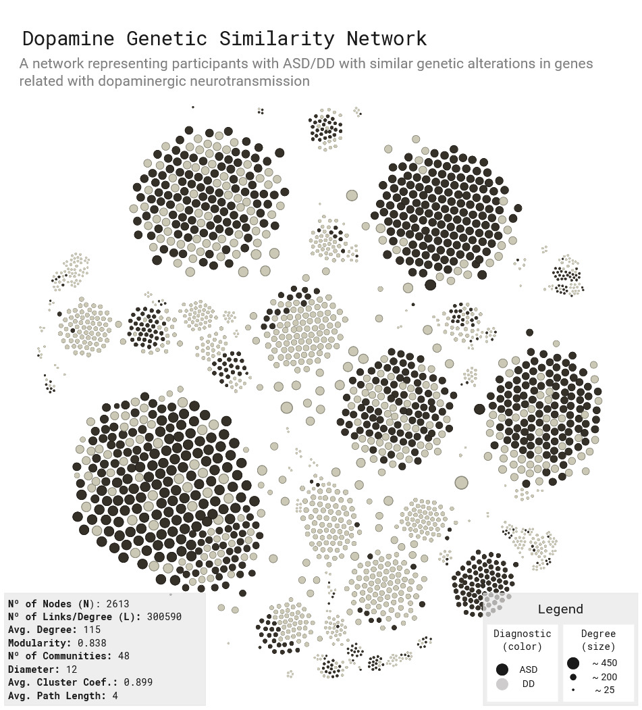  
*Dopamine Genetic Similarity Network.*  

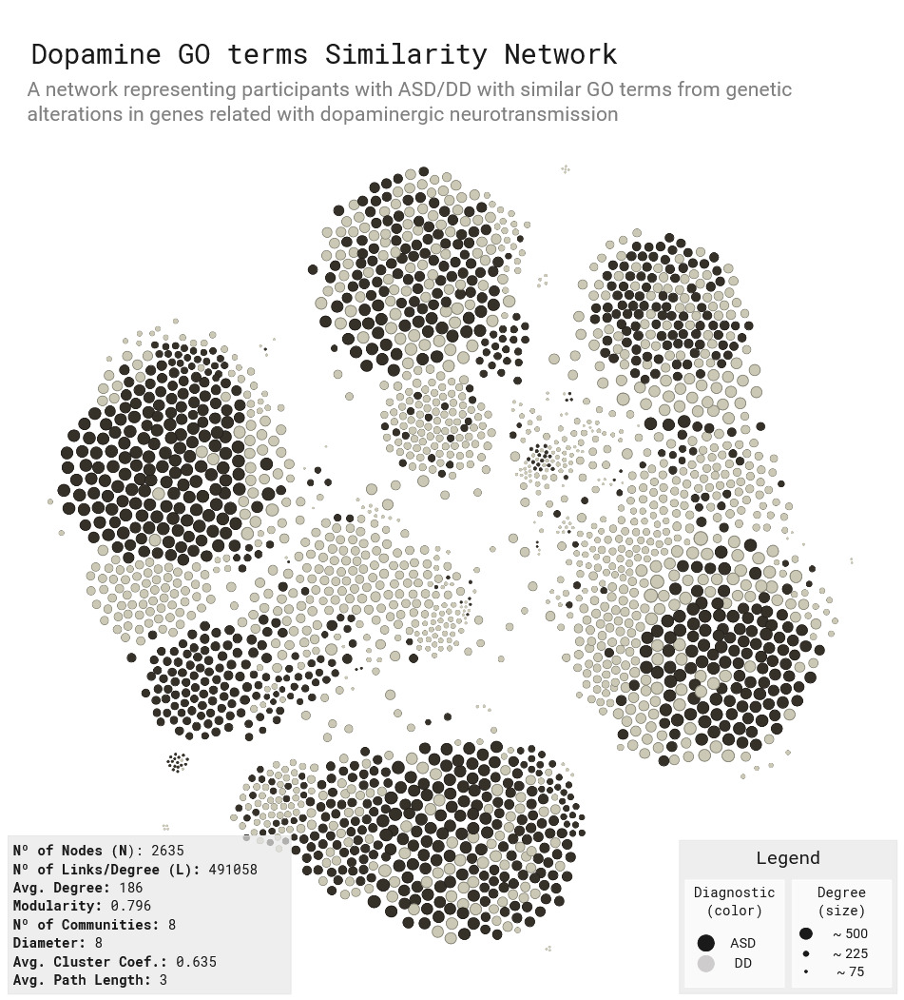  
*Dopamine GO Terms Similarity Network.*

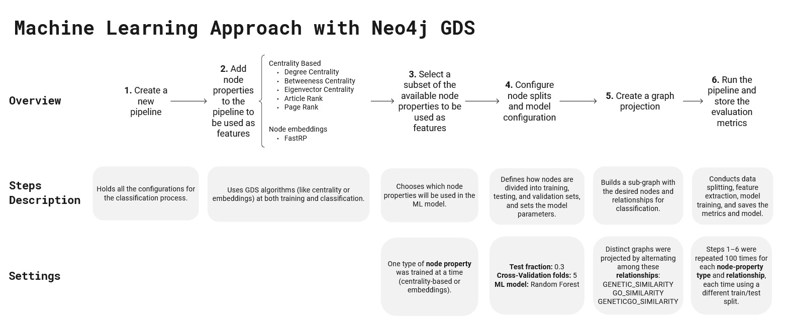  
*ML pipeline aproach using Graph-Native ML*  

**Tech Stack:**  
`Python · Neo4j Graph Data Science (GDS)  · Gephi · FastRP (graph embeddings) · Random Forests`

</details>

---

#### 2.1.4. Serotonergic Networks: Differentiating ASD and DD

*Exploring serotonergic CNVs and pathway signatures to classify neurodevelopmental disorders*

**Highlights:**
- Investigated **serotonergic gene dosage effects** (CNVs) in ASD (Autism Spectrum Disorder) and DD (Developmental Delay).  
- Constructed **gene- and GO-based networks** to analyze serotonergic mechanisms.  
- Found **ASD = 6 genetic clusters** (5 receptor-related) vs. **DD = 2 clusters** (more homogeneous).  
- Random Forest classifiers achieved **85.6% accuracy** (serotonergic features alone), rising to **88.6%** when combined with dopaminergic features.  
- GO-based features delivered comparable accuracy **with fewer inputs**, showing efficiency.  

<details>
<summary>📖 Read More</summary>

**Problem:**  
Differentiating ASD and DD remains **challenging**, as both share overlapping clinical features and partially overlapping genetic backgrounds. Serotonergic mechanisms are known to impact **social cognition and neurodevelopment**, but their **distinct roles in ASD vs DD** remain unclear. Existing approaches fail to disentangle how **different gene alterations may converge on the same serotonergic pathways** while still leaving distinct disease signatures.  

**Solution:**  
- Extracted CNVs from the **SFARI Gene CNV Module** related to **serotonergic signaling**.  
- Built participant–gene–GO term graphs to capture **dosage effects and functional annotations**.  
- Identified **hub nodes and subnetworks**, revealing distinct serotonergic signatures for ASD vs DD.  
- Deployed **Random Forest pipelines** with feature reduction (wrapper method) and repeated 100 validation cycles.  

**Impact:**  
- Revealed a **heterogeneous but pathway-convergent serotonergic profile in ASD**, with multiple receptor-related clusters.  
- DD participants showed **greater genetic homogeneity**, reflected in fewer serotonergic clusters.  
- Achieved high diagnostic accuracy (85–89%), underscoring **serotonergic CNVs as robust classifiers**.  
- Integration with dopaminergic features improved performance, supporting **cross-pathway mechanistic overlap**.  
- Suggests serotonin may play a **more direct causal role than dopamine** in differentiating ASD, highlighting **potential biomarkers and therapeutic targets**.  

**Supporting Figures:** 

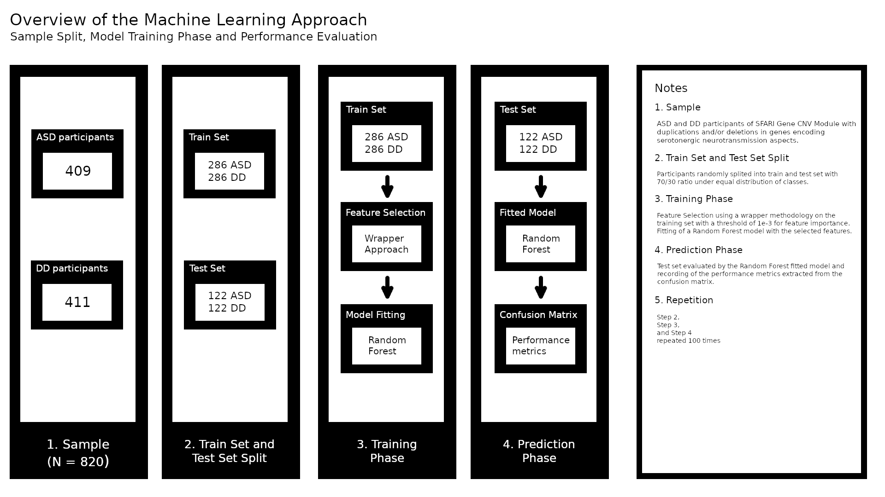  
*Random Forest workflow: feature reduction → training → repeated validation.*  

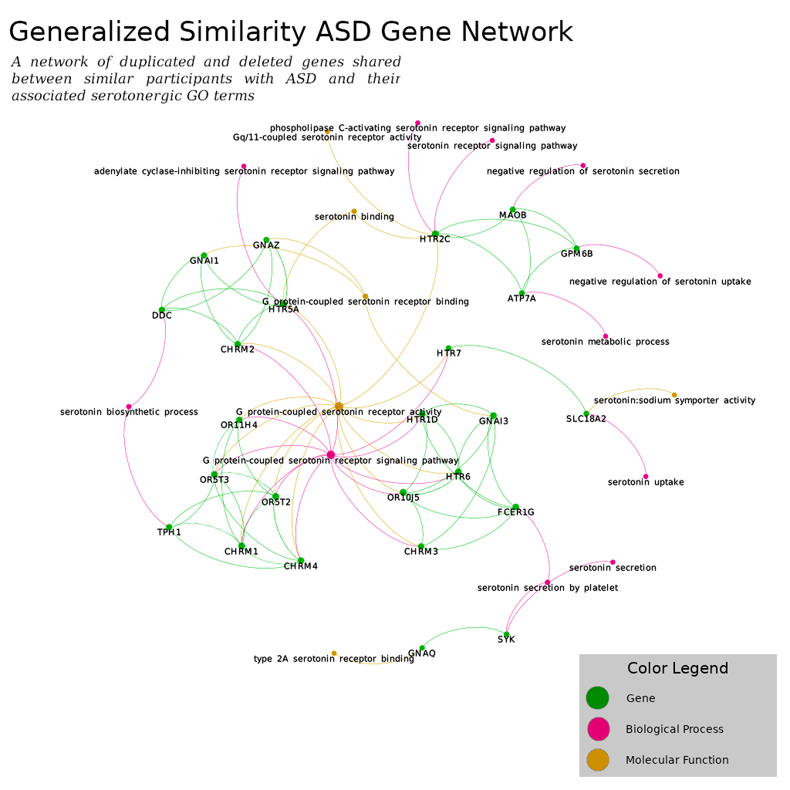  
*ASD serotonergic gene-GO similarity subgraph (heterogeneous multi-cluster profile).*  

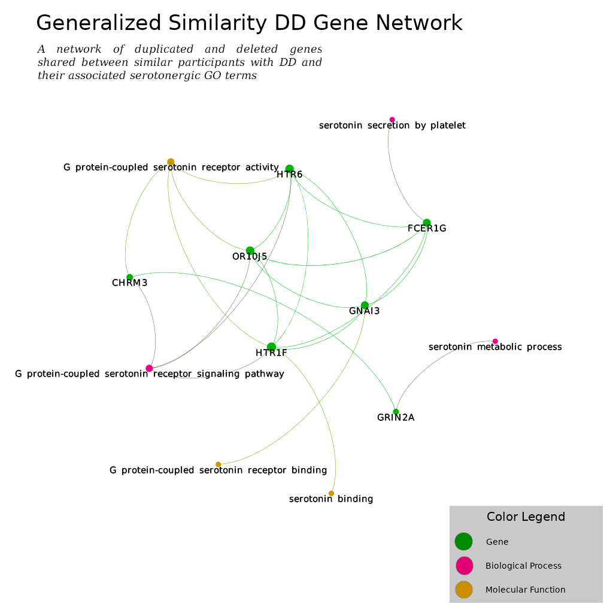  
*DD serotonergic gene-GO similarity subgraph (more homogeneous clustering).* 
  
**Tech Stack:**  
`Python · Ruby · R · scikit-learn · NetworkX · Gephi · Random Forests · Feature Wrappers`

</details>

---

### 2.2. CHUC Hospital — Digital Clinical Documentation 🏥

*Design and implementation of structured clinical documentation using SNOMED-CT and HL7-CDA*

**Highlights:**
- Designed and deployed a **prototype clinical documentation system** at CHUC’s Pediatric Neurodevelopment and Autism Unit (UNDA).  
- Integrated **HL7 Clinical Document Architecture (CDA)** and **SNOMED CT** terminology to achieve **semantic interoperability**.  
- Enabled creation of **structured, reusable templates** for consultations and assessments (e.g., Griffiths Mental Developmental Scale).  
- Established a **longitudinal view of patient data** supporting both clinical practice and research needs.  
- alidated in real hospital workflows, with potential to support **65.000+ medical practitioners** across public healthcare.  

<details>
<summary>📖 Read More</summary>

**Problem:**  
Traditional documentation systems at CHUC relied on **free-text entries and static patient files**, which:  
- Limited **data re-use for research** and clinical decision support.  
- Prevented **longitudinal perspectives** across repeated visits.  
- Created **integration issues** with other EHR components, increasing duplication and error risk.  
- Hindered **multidisciplinary coordination** in units like UNDA, where patients are seen by multiple specialists.  

**Solution:**  
- Developed a **three-layer architecture** (data access, logic, user interface) integrated with the national EHR platform *SClínico* and SONHO systems.  
- Implemented **structured templates** using **HL7 CDA** + **SNOMED CT** for interoperable, coded documentation.  
- Designed a **web-based UI** (ASP.NET MVC, HTML5/JS) with modular template building and SNOMED server search.  
- Validated with **multidisciplinary clinical teams**, enabling shared longitudinal data, re-usable forms, and export in XML/PDF formats.  

**Impact:**  
- Delivered **transparent, standardized, and interoperable data capture** for neuropediatric settings.  
- Supported **research integration**: structured datasets can be exported for analytics and population-level queries.  
- Improved **workflow efficiency**, reduced duplication, and strengthened **data quality**.  
- Enhanced **collaboration between clinic and research**, aligning with European data privacy legislation.  
- Recognized in **peer-reviewed publication (MDPI Healthcare, 2023)**.  

**Supporting Figures:** 

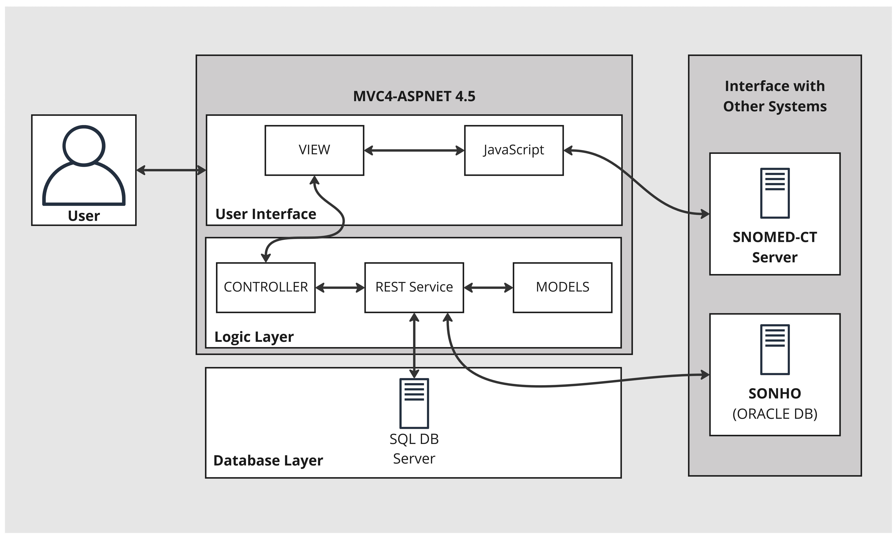  
*A three-layered architecture extending SClínico, interfacing with SNOMED-CT server and SONHO database.*  

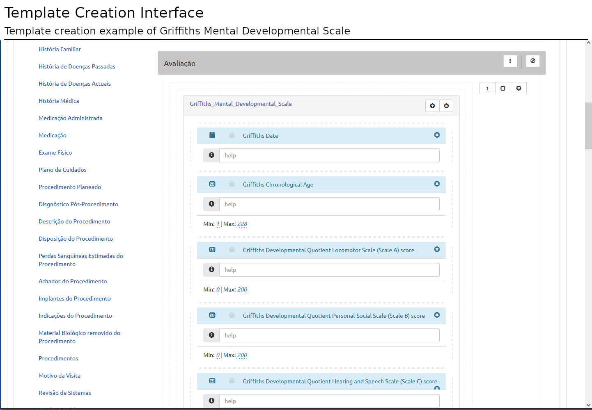  
*Example: Griffiths Mental Developmental Scale template, with cross-domain assessment areas.*  

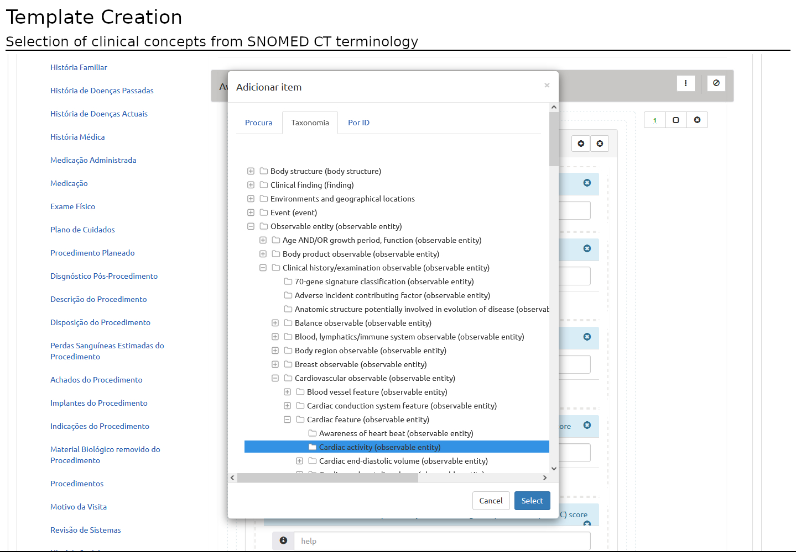  
*Template building using SNOMED concepts for semantic interoperability.*  

**Tech Stack:**  
`HL7 CDA · SNOMED-CT · ASP.NET MVC · MS SQL Server · REST API · JavaScript/jQuery/Bootstrap`  

**Publication:**  
📄 Direito, B., **Santos, A.**, Mouga, S., Lima, J., Brás, P., Oliveira, G., & Castelo-Branco, M. (2023).  
*Design and Implementation of a Collaborative Clinical Practice and Research Documentation System Using SNOMED-CT and HL7-CDA in the Context of a Pediatric Neurodevelopmental Unit*.  
**Healthcare, 11(7), 973.**  
👉 [https://doi.org/10.3390/healthcare11070973](https://doi.org/10.3390/healthcare11070973)  

</details>

---

### 2.3. CHUC Hospital - Integration of Clinical Documentation with National Healthcare System (SClínico) 📝

*Bridging structured digital documentation with the official hospital record system via HL7 and SNOMED-CT*

**Highlights:**
- Extended the **digital documentation system** (project 2.2.) with **direct integration to SClínico Hospitalar**.  
- Eliminated the need for clinicians to manually duplicate information into SClínico medical summaries.  
- Designed and implemented **HL7 message generation** from structured HL7-CDA + SNOMED-CT clinical documents.  
- Developed **LIGHt (Local Interoperability Gateway for Healthcare) integration** for message delivery.  
- Enabled clinicians to filter and **control which observations** are pushed into SClínico diaries, ensuring relevance and compliance.
- Introduced **dynamic UI modules** that detect user interactions (auto‑completion, field lock/unlock), improving ergonomics for clinicians.  
- Created **observation‑filtering routines** ensuring only relevant SNOMED‑coded fields reach the official EHR.  

<details>
<summary>📖 Read More</summary>

**Problem:**  
Although clinicians could fill clinical forms digitally (project 3), the lack of interoperability with *SClínico* forced them to **re-enter the same data** in medical summaries — a time‑consuming and frustrating workflow that discouraged adoption.  

**Solution:**  
- **HL7 message builder**: Transforms structured HL7‑CDA documents annotated with SNOMED‑CT into compliant HL7 messages.  
- **Messaging module**: Handles sending of HL7 messages to the *LIGHt* gateway, CHUC’s local interoperability service.  
- **Filtering module**: Dynamically selects which observations should be included in each HL7 message based on:  
  - Template specifications,  
  - Data collected in the form,  
  - Clinical choices or regulatory requirements.  
  → This ensures that only **relevant and clinician‑approved information** is written into SClínico clinical diaries.  

**Impact:**  
- Achieved **seamless integration** between the CHUC digital documentation platform and the official SClínico system.  
- **Reduced duplication** and improved clinician adoption by streamlining workflows.  
- Allowed clinicians to **retain control** over the granularity of information shared with SClínico.
- Enhanced workflow efficiency and information reliability for routine hospital use.  
- Paved the way for expanding structured documentation to **routine hospital workflows** at scale.  

**Supporting Figures:**  

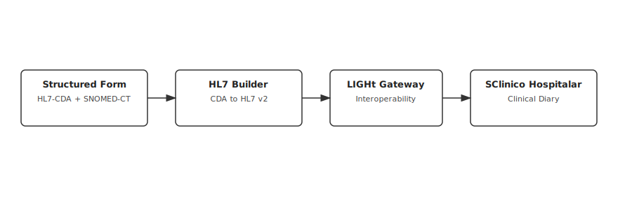  
*Architecture showing transformation of HL7‑CDA structured forms into HL7 messages and transmission via the LIGHt gateway into SClínico.*  

**Tech Stack:**  
`HL7 CDA · SNOMED‑CT · HL7 v2 Messaging · LIGHt (SNS) · ASP.NET MVC · MS SQL Server · REST Services · JavaScript · HTML/CSS`  

</details>

---

### 2.4. COVMind — Remote CBT (Cognitive Behavioral Therapy)/Mindfulness Platform 🧘

*Supporting psychological well‑being during COVID‑19 through structured online therapy sessions*

**Highlights:**
- Collaborated with a **PhD research psychologist** from the CIBIT research group.  
- Designed and implemented an online platform to deliver **8 interactive CBT/mindfulness sessions** for participants plus **8 control group sessions**.  
- Built with **Django (Python), JavaScript, relational databases, and secure user session management**.  
- Enabled integration of multiple **therapeutic tasks**:  
  - Psychological scales on anxiety and COVID impact  
  - Reading materials, video viewing, and audio listening  
  - Multiple-choice and free‑text responses  
  - Concept–definition matching tasks  
- Focused on helping participants **identify priorities** in work, life, and relationships.  

<details>
<summary>📖 Read More</summary>

**Problem:**  
COVID‑19 created profound psychological challenges, increasing anxiety and distress, while **in‑person CBT and mindfulness sessions were unavailable or limited**. Researchers at CIBIT needed a flexible web platform to conduct a controlled study with experimental and control groups.

**Solution:**  
- Developed a **modular web application** using **Django**, serving personalized session flows.  
- Implemented **dynamic task rendering**, allowing text, videos, and audios to be embedded within sessions.  
- Built forms to capture responses for:  
  - Standardized psychological scales,  
  - Open‑ and closed‑ended questionnaires,  
  - Matching tasks for reinforcing learning.  
- Managed **user authentication and session tracking** to ensure controlled participation across multiple sessions.  
- Designed the database schema to store participant progress, responses, and group assignments.  

**Impact:**  
- Enabled researchers to **deliver CBT and mindfulness interventions remotely** at scale.  
- Supported a **controlled clinical study design** with separate participant vs. control sessions.  
- Allowed nuanced data analysis of participant responses across task types.  
- Provided a platform that could be **reused or extended** for future clinical psychology research projects.  

**Supporting Figures:**

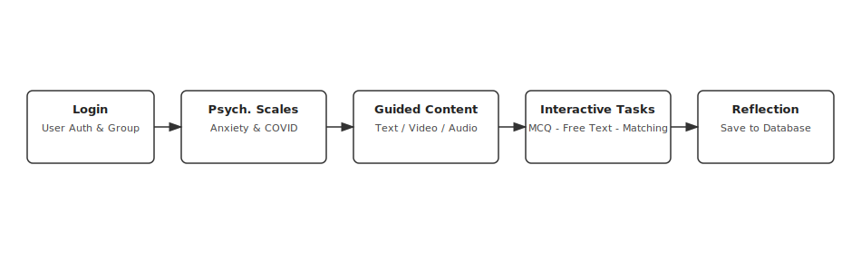
*Session flow example: A session moves from psychological scales → guided text/video/audio → interactive tasks → reflection questions.*

**Tech Stack:**  
`Python · Django · JavaScript · HTML/CSS · Relational Database (PostgreSQL/MySQL) · User Authentication`

</details>

---

### 2.5. CIMAGO — Data Science & ML in Genetic Cancer Research 🧪

#### 2.5.1.CIMAGO — Genetic Data Integration Platform 🧬

*Improving accessibility and traceability of CNV patient data for genomic research and clinical studies.*

**Highlights:**
- Collaboration with **CIMAGO (Centro de Investigação em Meio Ambiente, Genética e Oncobiologia)** in the context of research on **genetic cancer and neurodevelopmental diseases**.  
- Developed a **LAMP (Linux, Apache, MySQL, PHP/JavaScript)** application to simplify data management for patient CNV reports generated via **Array‑CGH/Microarray** technologies.  
- Provided a **secure, searchable web interface** enabling clinicians to:  
  - Upload semi‑structured Excel/CSV spreadsheets from CNV analyses  
  - Parse and standardize patient and variant information into a structured **MySQL relational database**  
  - Query, filter, and visualize CNV information by patient, chromosome region, or gene  
- Replaced a manual file‑based workflow with a **centralized, accessible data repository**, ensuring improved clinical traceability and data re‑use.  

<details>
<summary>🔬 Read More</summary>

**Problem:**  
Before the platform, clinicians and researchers stored dozens of Array‑CGH (microarray) result spreadsheets dispersed across computers.  
This fragmentation made CNV data **hard to consult, compare, and maintain**, limiting the capacity for clinical follow‑up and scientific analysis.

**Solution:**  
- Designed a **relational database schema** optimized for CNV and patient metadata (individual identifiers, chromosomal location, variant type, annotations).  
- Implemented automatic spreadsheet parsers to:  
  - Validate and normalize file contents  
  - Extract CNV fields  
  - Load them into **MySQL tables** following defined relationships between patients, clinics, and variants.  
- Built a **web portal** for data upload and exploration:  
  - User authentication and permissions  
  - Record search and filtering interface  
  - Gene‑ and chromosome‑level visualization options  
- Linked to **external genomic resources**, such as the **UCSC Genome Browser** and **GeneCards Human Gene Database**, enabling downstream analysis of candidate genes.  

**Impact:**  
- Consolidated disparate spreadsheet data into a single **searchable knowledge base**.  
- Improved **clinical traceability** and data‑driven decision making.  
- Built a foundation for future integration with **machine learning pipelines** in genotype–phenotype research.

**Supporting Figures:**

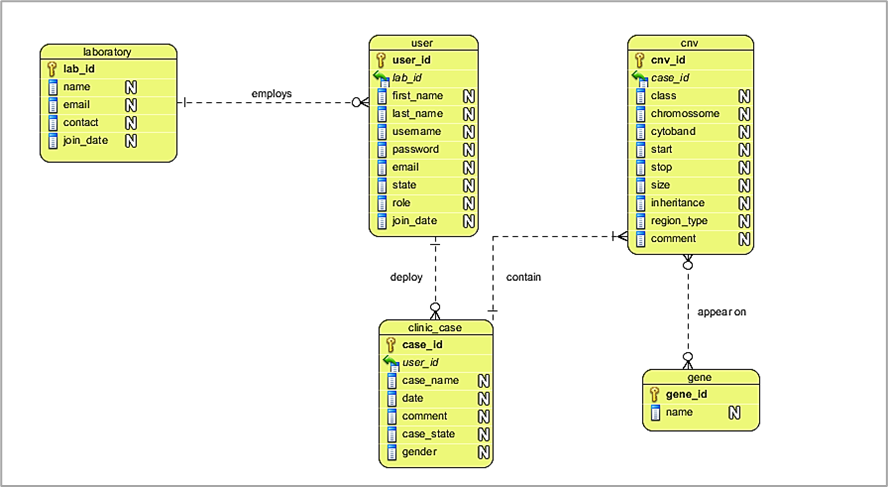
*Diagram showing the relational schema connecting patients, clinics, CNVs, and variant annotations. Each CNV record includes genomic coordinates, type (loss/gain), and reference gene information, linked to its respective clinic case and patient.*

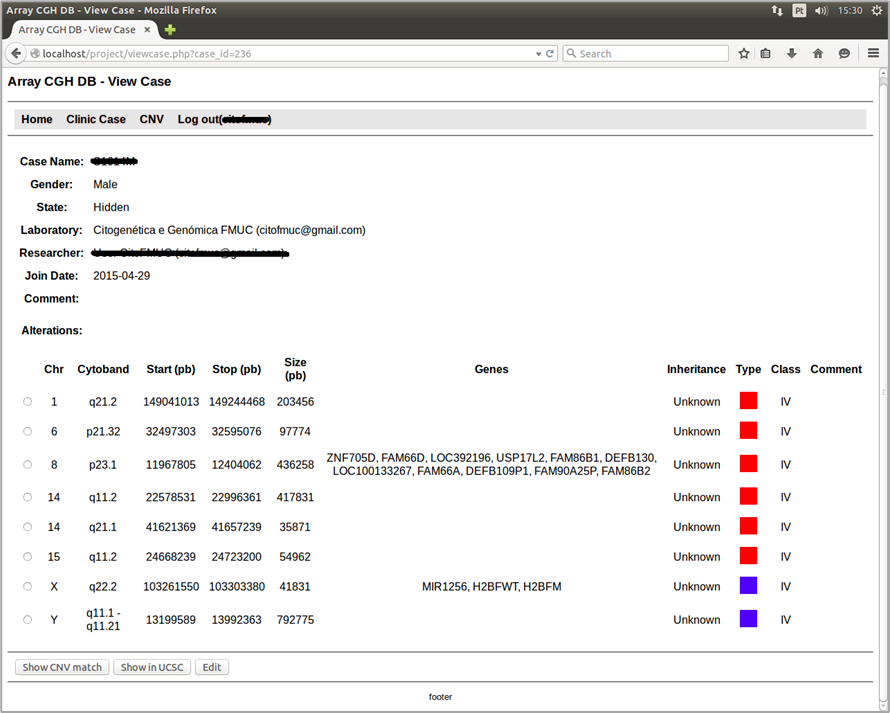
*Interface view showing a clinic case with full details and associated CNVs. If the researcher is assigned to the case, CNVs can be edited. For all users, “Show CNV Match” and “Show in UCSC” actions are available. Clicking on a gene name opens detailed gene information from the [GeneCards Human Gene Database](http://www.genecards.org).*

**Tech Stack:**  
`LAMP Stack (Linux · Apache · MySQL · PHP) · JavaScript · HTML5/CSS3 · Data Normalization · Secure Web Authentication`

</details>

---

#### 2.5.2. CIMAGO — Machine Learning in Oral Cancer Genomics 🔬

*Applying data‑science and machine‑learning techniques to integrate genomic and epigenetic datasets in oral cancer research.*

**Highlights**
- Collaboration with the **Cytogenetics and Genomics Laboratory** at the **Faculty of Medicine, University of Coimbra**, through **CIMAGO (Centro de Investigação em Meio Ambiente, Genética e Oncobiologia)**.  
- Worked alongside **PhD and MSc students**, including **Ilda Patrícia Ribeiro**, under the supervision of **Prof. Isabel Marques Carreira**, **Prof. Francisco Marques**, and **Prof. Joana Barbosa Melo**.  
- Designed and implemented **machine‑learning workflows** to classify and cluster **oral squamous cell carcinoma (OSCC)** samples based on **genomic and epigenetic profiles**.  
- Contributed to studies later published in international, peer‑reviewed journals.  

<details>
<summary>📘 Read More</summary>

**Problem:**  
Genomic and epigenetic data from OSCC projects were **heterogeneous, high‑dimensional**, and originated from multiple array‑based and molecular techniques.  
Researchers needed a unified methodology to:  
- Integrate heterogeneous CNV and expression datasets.  
- Discover **patterns of genomic alteration** linked to tumor heterogeneity or progression.  
- Perform **classification and clustering** with validated, reproducible preprocessing steps.


**Solution:**  
- Developed **data‑cleaning and normalization pipelines** to harmonize CNV and transcriptomic data.  
- Prototyped and tuned **machine‑learning models** (classification & clustering) to explore tumor relationships and genomic signatures.  
- Conducted **feature selection** and **exploratory data analysis** to identify recurrent genomic regions and candidate biomarkers.    
- Collaborated closely with clinicians and students to validate model outcomes and interpret biologically meaningful features.

---

**Impact:**  
- Enabled **systematic analysis** of genomic and epigenetic alterations across OSCC samples and patient cases.  
- Strengthened **data reproducibility and transparency** in ongoing research at CIMAGO.  
- Directly contributed to publications in high‑impact journals, including:  
  - Ribeiro IP et al. (2017) *Molecular Cytogenetics*. [DOI: 10.1186/s13039‑017‑0310‑z]  
  - Ribeiro IP et al. (2016) *European Journal of Human Genetics*, 24(1): p279. (Q1 IF 4.580)  
  - Carreira IM et al. (2016) *European Journal of Human Genetics*, 24(1): p295. (Q1 IF 4.580)  
- Presented findings at the **5º Congresso da CIMAGO (2016)** — including studies on chromosomal gains/losses and genomic breakpoints in oral cancer.


**Tech Stack**  
`R · Ruby · Python · MySQL · LAMP Integration · Data Wrangling · Machine Learning (Classification & Clustering) · Exploratory Data Analysis · Genomic Feature Engineering`

</details>

---


## 3. Exploration Projects 🤖

### 3.1. HNotes — Semantic Health Data Capture Platform 🧠💾

*A personal project and learning experiment developed in **Elixir/Phoenix LiveView** to explore semantic modeling of medical information.*

**Highlights**
- Built a **web‑based proof of concept** named **HNotes (Healthcare Notes)** allowing users to record and organize health data into **notes grouped inside notebooks**.  
- Each note associates with an individual (*organism + identifier*) and contains structured health records defined through **SNOMED CT terminology**.  
- Designed to ensure that each measurement is **semantically unambiguous**, enabling interoperability and potential data exchange with other health systems.  
- Developed both **backend and frontend** (Elixir/Phoenix LiveView with Ecto for persistence).  
- Includes example use‑cases such as **cardiac measurement entries (blood pressure records)** with SNOMED‑conformant components and attributes.

<details>
<summary>📘 Read More</summary>

**Problem**  
Traditional spreadsheet‑style or free‑text clinical note systems make it difficult to **interpret, integrate, or share** health records unambiguously between systems.  
To achieve semantic consistency, each observation needs to describe *what was measured*, *the property observed*, *when*, *where/on what specimen*, *how it was quantified*, and *by which method* — information that most tools either oversimplify or ignore.  

Clinicians and researchers require a **lightweight tool** capable of collecting structured health observations while maintaining **semantic interoperability** in accordance with **SNOMED CT**.

---

**Solution**  
- Designed and implemented **HNotes**, where each entry includes six fields corresponding to SNOMED CT‑defined concepts:  
  1. **Component** – what was measured/observed  
  2. **Property** – characteristic or attribute being described  
  3. **Time** – interval of observation  
  4. **System/Specimen** – biological system or tissue analyzed  
  5. **Scale** – measurement scale (quantitative, ordinal, nominal)  
  6. **Method** – technique or clinical procedure employed  
- Constrained each field to **specific SNOMED CT subsets**, ensuring consistent term usage (e.g., Components from *Observed Entity*).  
- Built the **LiveView front‑end** for dynamic, reactive data entry and **real‑time updates**.  
- Structured data persistence through **Ecto + PostgreSQL/MySQL**, using strongly typed schema definitions.  
- Implemented the concept of **notebooks** → **notes** → **registries**, organizing observations hierarchically.  
- Developed an **example use case** for cardiovascular data capture, demonstrating component selection (“Systolic blood pressure”), unit (“mmHg”), and context (“Arterial system structure”).

---

**Impact**  
- Demonstrates how **semantic encoding using SNOMED CT** can be incorporated in user‑friendly, real‑time web applications.  
- Provides a **reusable data model** applicable to both clinical and research contexts without imposing profession‑based restrictions.  
- Showcases **Elixir/Phoenix LiveView**’s capabilities for **interactive health data management** — rapid UI updates, parallel processing, and scalability across distributed nodes.  
- Serves as a **learning platform** for combining semantic interoperability, functional programming, and modern web engineering.

---

**Supporting Figures**

**Figure 1 – Example of a Cardiac Record Entry**  
Interface of the *HNotes* prototype showing a notebook with a clinical note and associated health registries.  
Each row represents a blood‑pressure measurement characterized by its **SNOMED CT fields** (Component, Property, Time, System, Scale, Method) and corresponding value.  

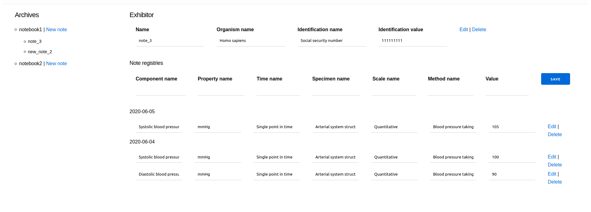

**Supplementary Video (S1)** – Live use‑case demonstration of data entry and interactive updates in hnotes (Phoenix LiveView interface).  <a href="https://youtu.be/D4lbiLlnmoc" target="_blank" rel="noopener noreferrer">
  Watch on YouTube ▶️
</a>

---

**Tech Stack**  
`Elixir · Phoenix Framework (LiveView) · Ecto · PostgreSQL/MySQL · SNOMED CT Terminology · Semantic Web Modeling · HTML5/CSS3`

</details>

---


### 3.2. LLM Wiki — AI-Assisted Knowledge Management 🧠📚

*Structured, source-linked research wikis built and maintained collaboratively with Claude Code, governed by standing `CLAUDE.md` instruction sets.*

**Highlights:**
- Designed a repeatable **ingest → discuss → write → link → index → log** workflow that turns raw source material into a persistent, cross-referenced markdown wiki instead of a lost chat history.
- Built and maintained three instances: a **20+ page PhD defence wiki**, a **19-page EU competition (EPSO AD7) exam-prep wiki**, and **Forge**, a 26-page meta-wiki comparing multiple AI-assisted development methodologies.
- Extended the base workflow with domain-specific output templates baked into `CLAUDE.md` (e.g. fixed MCQ and EUFTE-briefing formats for exam prep), and, in Forge, converted synthesized knowledge into reusable `CLAUDE.md` templates and project scaffolds for downstream projects.

<details>
<summary>📖 Read More</summary>

**Problem:**

Ad-hoc chats with an AI assistant lose their context and structure once the conversation ends, making it hard to accumulate knowledge across sessions or reuse it for a high-stakes, long-running goal (a thesis defence, a competitive exam, an evolving methodology).

**Solution:**

- Authored a `CLAUDE.md` file per project giving Claude standing instructions: how to ingest a new source, where it belongs in the wiki, how to cross-link and cite it, and how to keep a master index and append-only log.
- Workflow: drop a source into `raw/` → Claude reads and discusses key takeaways → Claude creates/updates wiki pages with cross-links → index and log are updated → periodic lint/audit passes catch orphan pages, dead links, and contradictions.
- Adapted the same base method to three different domains, each adding domain-specific structure on top: jury-profile and anticipated-question pages for a PhD defence, legislation/policy pages plus exam-format templates for an EU competition, and author/concept/tool/synthesis pages comparing four named AI-dev methodologies for Forge.

**Impact:**

- **PhD Defence Wiki** (2025–2026): 20+ pages across thesis methodology, results, jury profiles, and literature, built from 15+ sources; contributed to a thesis defence awarded *Aprovado com Distinção e Louvor* (18.300/20).
- **EPSO AD/426/25 Competition Prep Wiki** (2026, in progress): 19 pages covering EU data-protection and digital-policy legislation across 22 source documents, plus a 25-question MCQ practice bank and draft EUFTE briefings generated from exam-specific templates embedded in `CLAUDE.md`.
- **Forge** (2026–present): a meta-wiki cross-comparing four AI-assisted development methodologies (Karpathy's LLM Wiki, Van Clief's Interpretable Context Methodology, Kahler's PAUL/SEED ecosystem, GSD's spec-driven approach) across 26 pages and 15 sources, converting the synthesis into reusable `CLAUDE.md` templates and project scaffolds rather than stopping at reference notes.
- Demonstrates a workflow that scales from single-domain knowledge capture to comparative, cross-framework synthesis — and from organizing source material to designing the governing instruction-set architecture itself.

**Tech Stack:**

`Claude Code · Markdown · Structured CLAUDE.md instruction sets · Git`

</details>

---

## 4. Publications 📚

- **Santos, A.**, Caramelo, F., Melo, J. B., & Castelo-Branco, M.  
  *Dopaminergic Gene Dosage Reveals Distinct Biological Partitions between Autism and Developmental Delay as Revealed by Complex Network Analysis and Machine Learning Approaches*.  
  **Journal of Personalized Medicine**, 12(10), 1579, 2022.  
  👉 [https://doi.org/10.3390/jpm12101579](https://doi.org/10.3390/jpm12101579)    

- **Santos, A.**, Caramelo, F., Melo, J. B., & Castelo-Branco, M.  
  *A relational database of SFARI Gene CNVs data integrated with associated genes and GO terms for the study of genetics in neurodevelopmental disorders*.  
  **Harvard Dataverse**, V1, 2022.  
  👉 [https://doi.org/10.7910/DVN/HO1JLJ](https://doi.org/10.7910/DVN/HO1JLJ)

- Direito, B., **Santos, A.**, Mouga, S., Lima, J., Brás, P., Oliveira, G., & Castelo-Branco, M.  
  *Design and Implementation of a Collaborative Clinical Practice and Research Documentation System Using SNOMED-CT and HL7-CDA in the Context of a Pediatric Neurodevelopmental Unit*.  
  **Healthcare**, 11(7), 973, 2023.  
  👉 [https://doi.org/10.3390/healthcare11070973](https://doi.org/10.3390/healthcare11070973)  


<details>
<summary>📑 Cite My Work (BibTeX)</summary>

```bibtex
@article{Santos2022Dopamine,
  author    = {Santos, André and Caramelo, Francisco and Melo, Joana Barbosa and Castelo-Branco, Miguel},
  title     = {Dopaminergic Gene Dosage Reveals Distinct Biological Partitions between Autism and Developmental Delay as Revealed by Complex Network Analysis and Machine Learning Approaches},
  journal   = {Journal of Personalized Medicine},
  year      = {2022},
  volume    = {12},
  number    = {10},
  pages     = {1579},
  doi       = {10.3390/jpm12101579},
  publisher = {MDPI}
}

@dataset{Santos2022Dataverse,
  author    = {Santos, André and Caramelo, Francisco and Melo, Joana Barbosa and Castelo-Branco, Miguel},
  title     = {A relational database of SFARI Gene CNVs data integrated with associated genes and GO terms for the study of genetics in neurodevelopmental disorders},
  year      = {2022},
  publisher = {Harvard Dataverse},
  version   = {V1},
  doi       = {10.7910/DVN/HO1JLJ},
  url       = {https://doi.org/10.7910/DVN/HO1JLJ}
}

@article{Direito2023Healthcare,
  author    = {Direito, Bruno and Santos, André and Mouga, Susana and Lima, João and Brás, Paulo and Oliveira, Guiomar and Castelo-Branco, Miguel},
  title     = {Design and Implementation of a Collaborative Clinical Practice and Research Documentation System Using SNOMED-CT and HL7-CDA in the Context of a Pediatric Neurodevelopmental Unit},
  journal   = {Healthcare},
  year      = {2023},
  volume    = {11},
  number    = {7},
  pages     = {973},
  doi       = {10.3390/healthcare11070973},
  publisher = {MDPI}
}
```
</details>


---

## 5. Skills 🛠️

### Programming & Frameworks  
`Python · R · Elixir (Phoenix, LiveView) · Ruby (Rails) · JavaScript · Java · SQL · ASP.NET MVC · HTML/CSS`

### AI & Machine Learning  
`scikit‑learn · Neo4j Graph Data Science · Exploratory Data Analysis · Feature Engineering · Data Preprocessing Pipelines`

### Healthcare & Data Standards  
`HL7‑CDA · HL7 v2 Messaging · SNOMED‑CT · Semantic Interoperability`

### Databases & Data Engineering  
`PostgreSQL · MySQL · Neo4j · Relational & Graph Modeling · ETL / Data Normalization`

### Tools & Operating Environments  
`Git · GitHub · Postman · Linux (LAMP stack) · Windows · XML · JSON · HTML · CSS`

---

## 6. Current Focus 🌱

I am currently exploring two intersecting areas that connect my experience in data science and biomedical informatics with the emerging field of **Generative AI** and **narrative visualization**.

---

**🧠 Generative AI in Action — Amit Bahree (Manning Publications)**  
Focusing on the **architectural patterns and deployment practices** of large language models (LLMs) and retrieval‑augmented generation (RAG).  
My goal is to deepen my understanding of:  
- How enterprise systems can integrate generative AI responsibly and efficiently.  
- Refinement of **prompt‑engineering** workflows and **model adaptation/fine‑tuning**.  
- Ethical and operational aspects such as transparency, hallucination mitigation, and scalable infra design.  
[Read more →](https://www.manning.com/books/generative-ai-in-action){:target="_blank" rel="noopener noreferrer"}

---

**📊 Data Storytelling with Altair and AI — Angelica Lo Duca (Manning Publications)**  
Exploring how **Python (Altair)** and **Generative AI tools** can elevate data comprehension through visual and narrative communication.  
I am particularly interested in:  
- Using **Altair’s declarative visualization grammar** to convey complex molecular and clinical datasets.  
- Applying **AI‑assisted narrative generation** (e.g., text/image co‑generation) to transform findings into accessible insights.  
- Structuring analyses around the **DIKW Pyramid (Data → Information → Knowledge → Wisdom)** to encourage clarity and impact.  
[Read more →](https://www.manning.com/books/data-storytelling-with-altair-and-ai){:target="_blank" rel="noopener noreferrer"}

---

These themes align with my broader research direction:  
building **interpretable, semantically‑robust AI systems** that not only analyze data but also **communicate results effectively** to humans.

---

## Let’s Connect 📫

- [LinkedIn](https://www.linkedin.com/in/andre-santos-407224205/)
- [Github](https://github.com/afs091/)
- afsantos091@gmail.com  