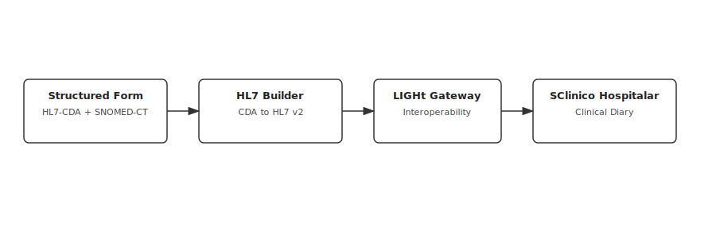

# Portfolio

## 1. About me

👋 Hi, I’m André Ferreira Santos 

**Biomedical Engineer | Data & AI Enthusiast | Transforming complexity into clarity with data, design & AI**  

I build standards-driven, user-centric tools that turn complex data into actionable insights.  
Currently pursuing a PhD in Biomedical Engineering (Univ. of Coimbra), applying **graph analytics & ML to autism genetics**, while expanding into **AI/LLM applications** for real-world impact.  

🌍 Passionate about open science, human-centric design, and digital transformation.  

---


## 2. Featured Projects 🚀

### 2.1. PhD Project — From Copy Number Variations to Biological Networks 🧬

**Integrating relational databases, graph theory & machine learning to decode dopaminergic and serotonergic mechanisms in autism and developmental delay.**

#### 2.1.1. From Unstructured Data to Relational and Graph Databases

*Relational and Graph Databases for Neurodevelopmental Genetics Using SFARI Gene CNV Data*

**Highlights:**
- Transformed raw SFARI CNV text files into **analysis-ready relational & graph databases**.
- Produced **+68k patient–CNV associations across +28k individuals**.
- Released as **open science resource** (800+ downloads) for reuse in genetic and network analyses.

<details>
<summary>📖 Read More</summary>

**Problem:**

Copy Number Variations (CNVs)—duplications or deletions of genomic regions—play a major role in neurodevelopmental disorders such as Autism Spectrum Disorder (ASD).  
Although SFARI Gene aggregates CNV data from global ASD studies, the resource is distributed as **unstructured, heterogeneous text files** with inconsistent terms and implicit inter-record relationships. This lack of standardization prevented **computational analysis, large-scale integration, and hypothesis generation**. 

**Solution:**

We designed a **structured ETL workflow** to transform SFARI CNV data into queryable and extensible databases:
1. **Relational database (MySQL):** Integrated harmonized CNV calls, participant metadata, and gene/GO annotations (via Ensembl Biomart).
2. **Graph database (Neo4j):** Encoded biological relationships (*gene ↔ diagnosis*, *CNV ↔ participant*) to enable network-based analytics.
3. **Data normalization & curation:** Regex-based harmonization of terms, genome build standardization (GRCh38/hg38), and **explicit schema design** to ensure scalability.

**Impact:**

- Generated a **knowledge base of 68,811 patient–CNV associations** mapped across 28,717 individuals.
- Enabled **hypothesis generation** and efficient queries of patterns previously hidden in unstructured text.
- Created a **modular framework** extendable to external omics datasets (e.g., transcriptomics, proteomics).
- Contributed an **open science resource** used by the community (800+ downloads). 

**Supporting Figures:**


*Workflow for transforming raw CNV data into analysis-ready relational & graph databases.*


*Relational schema connecting patients, CNVs, diagnoses, genes, and annotations via many-to-many relationships.*


*Graph model showing patients, CNVs, genes, and diagnoses, enabling network-based analysis.*

**Tech Stack:**

`MySQL · Neo4j · Ensembl Biomart · Python, Ruby & R (regex, ETL scripts) · GRCh38/hg38 genome builds`

**Open Science:**  
All datasets and scripts are publicly available 👉 [Dataverse Repository](https://doi.org/10.7910/DVN/HO1JLJ)  

</details>

---

#### 2.1.2. Dopaminergic Networks and Diagnosis Classification in Autism Spectrum Disorder and Developmental Delay

*Complex network analysis and machine learning for disentangling dopaminergic mechanisms in ASD and DD*

**Highlights:**
- Built **multi-layer networks** (genes, GO terms, participants) to study dopaminergic imbalance in ASD vs. DD.  
- Identified **four disrupted dopaminergic mechanisms** in ASD versus a more unified dopaminergic pattern in DD.  
- Achieved **85.2% classification accuracy** distinguishing ASD from DD using Random Forests (features: 117 genes / 62 GO terms).  
- Proposed a **biology-driven ontological feature space** that compactly generalizes across genetic variability.  

<details>
<summary>📖 Read More</summary>

**Problem:**  
The neurobiological underpinnings of autism spectrum disorder (ASD) remain unclear, partly due to its **phenotypic and genetic heterogeneity**. While dopaminergic dysfunction is a strong candidate mechanism, no framework existed for functionally comparing dopaminergic gene dosage effects in **ASD vs. Developmental Delay (DD)**.  

**Solution:**  
We applied **complex network analysis** to SFARI CNV datasets in order to capture dopaminergic disruptions:  
1. Constructed **Gene Dosage Networks** linking duplications/deletions of dopamine-related genes to participants.  
2. Built **GO-based Networks** (biological processes, molecular functions, cellular localization of the dopaminergic synapse).  
3. Analyzed hubs, modularity, and community structures to reveal disease-specific subnetworks.  
4. Trained **Random Forest models** on network-derived feature vectors to classify ASD vs. DD.

**Impact:**  
- Found that **ASD networks fractionated into four distinct disrupted mechanisms** (receptor binding, dopamine metabolism, synaptic physiology, neuronal differentiation).  
- DD presented **a more unified low-modularity dopaminergic profile**, highlighting a key biological distinction from ASD.  
- Achieved **85.18% (±1.1%) accuracy** in classifying ASD vs. DD (test set: 790 individuals), surpassing prior genetics-only studies and nearing imaging-based approaches.  
- Demonstrated that only **62 GO-derived features** achieved similar performance to gene features, supporting the value of a **compact ontology-driven feature space**.  
- Advances the case for **knowledge-based machine learning pipelines** in neurodevelopmental diagnoses.  

**Supporting Figures:** 

  
*Dopaminergic Gene Dosage Network.*

  
*Dopaminergic GO Network.*

  
*Workflow: feature extraction → feature selection → Random Forest classification.* 

**Tech Stack:**  
`MySQL · Ruby · Python · scikit-learn · R · NetworkX · Gephi `

**Publication:**  
Full peer-reviewed article published in *Journal of Personalized Medicine* (Special Issue: Systems Medicine and Bioinformatics).  
📄 [Dopaminergic Gene Dosage Reveals Distinct Biological Partitions between Autism and Developmental Delay as Revealed by Complex Network Analysis and Machine Learning Approaches](https://doi.org/10.3390/jpm12101579)   

</details>

---

#### 2.1.3. Graph-Native Machine Learning for Node Classification with Participant Similarity Networks using Dopaminergic Features

*Using dopaminergic genetic similarity graphs to classify ASD vs. DD participants with graph-native ML*

**Highlights:**
- Built **participant similarity networks** (N=2343; ASD=1288, DD=1055) from dopaminergic CNVs + GO terms.  
- Constructed three graph types: **genetic similarity (gs)**, **GO-term similarity (gos)**, and **combined (ggos)**.  
- Demonstrated that **graph embedding features outperformed centrality metric features** for classification tasks.  
- Achieved **>84% accuracy** in ASD vs DD classification with embedding-based Random Forests.  
- Revealed **finer subgroup structures in ASD**, while GO terms grouped participants into broader communities.  

<details>
<summary>📖 Read More</summary>

**Problem:**  
ASD and DD are **multifactorial disorders** with **highly heterogeneous genetic and functional profiles**. Individual genetic variants contribute weakly, and shared clinical labels often mask divergent molecular mechanisms. Traditional ML treats participants as **independent datapoints**, missing the **networked relationships** that emerge from shared dopaminergic disruptions. A graph-native approach is needed to capture these relational patterns for better classification and subgroup discovery.  

**Solution:**  
- Constructed a **graph database** linking participants → dopamine genes → GO terms.  
- Computed pairwise participant similarity vectors based on gene and/or GO features.  
- Built three similarity networks: **gs, gos, ggos**.  
- Extracted node-level features via **centrality** & **graph embeddings (node2vec)**.  
- Trained **Random Forest classifiers** with 5-fold CV to predict ASD vs DD.  

**Impact:**  
- Showed that network representation strongly shapes participant clustering:  
  - **gs:** fragmented into 48 highly modular subgroups (fine-grained genetic signal).  
  - **gos:** only 8 broader communities (functional similarity).  
  - **ggos:** intermediate (12 modules; compact yet heterogeneous).  
- **Similarity trends:** ASD–ASD pairs most similar across all networks, DD/DD and ASD/DD weaker.  
- **Classification results:**  
  - Centrality features ~78–80% accuracy.  
  - Embedding features **>84% accuracy**, with ASD precision (88.7%) and DD recall (90.2%) strongest in gs network.  
  - Integration of genetic + functional features improved robustness and balance.  
- Paves the way for **multi-omics + clinical graph integration** in GNML pipelines for ASD diagnostics.

**Supporting Figures:** 

  
*Dopamine Genetic Similarity Network.*  

  
*Dopamine GO Terms Similarity Network.*

  
*ML pipeline aproach using Graph-Native ML*  

**Tech Stack:**  
`Python · Neo4j Graph Data Science (GDS)  · Gephi · node2vec (graph embeddings) · Random Forests`

</details>

---

#### 2.1.4. Serotonergic Networks: Differentiating ASD and DD

*Exploring serotonergic CNVs and pathway signatures to classify neurodevelopmental disorders*

**Highlights:**
- Investigated **serotonergic gene dosage effects** (CNVs) in ASD (Autism Spectrum Disorder) and DD (Developmental Delay).  
- Constructed **gene- and GO-based networks** to analyze serotonergic mechanisms.  
- Found **ASD = 6 genetic clusters** (5 receptor-related) vs. **DD = 2 clusters** (more homogeneous).  
- Random Forest classifiers achieved **85.6% accuracy** (serotonergic features alone), rising to **88.6%** when combined with dopaminergic features.  
- GO-based features delivered comparable accuracy **with fewer inputs**, showing efficiency.  

<details>
<summary>📖 Read More</summary>

**Problem:**  
Differentiating ASD and DD remains **challenging**, as both share overlapping clinical features and partially overlapping genetic backgrounds. Serotonergic mechanisms are known to impact **social cognition and neurodevelopment**, but their **distinct roles in ASD vs DD** remain unclear. Existing approaches fail to disentangle how **different gene alterations may converge on the same serotonergic pathways** while still leaving distinct disease signatures.  

**Solution:**  
- Extracted CNVs from the **SFARI Gene CNV Module** related to **serotonergic signaling**.  
- Built participant–gene–GO term graphs to capture **dosage effects and functional annotations**.  
- Identified **hub nodes and subnetworks**, revealing distinct serotonergic signatures for ASD vs DD.  
- Deployed **Random Forest pipelines** with feature reduction (wrapper method) and repeated 100 validation cycles.  

**Impact:**  
- Revealed a **heterogeneous but pathway-convergent serotonergic profile in ASD**, with multiple receptor-related clusters.  
- DD participants showed **greater genetic homogeneity**, reflected in fewer serotonergic clusters.  
- Achieved high diagnostic accuracy (85–89%), underscoring **serotonergic CNVs as robust classifiers**.  
- Integration with dopaminergic features improved performance, supporting **cross-pathway mechanistic overlap**.  
- Suggests serotonin may play a **more direct causal role than dopamine** in differentiating ASD, highlighting **potential biomarkers and therapeutic targets**.  

**Supporting Figures:** 

  
*Random Forest workflow: feature reduction → training → repeated validation.*  

  
*ASD serotonergic gene-GO similarity subgraph (heterogeneous multi-cluster profile).*  

  
*DD serotonergic gene-GO similarity subgraph (more homogeneous clustering).* 
  
**Tech Stack:**  
`Python · Ruby · R · scikit-learn · NetworkX · Gephi · Random Forests · Feature Wrappers`

</details>

---

### 3. CHUC Hospital — Digital Clinical Documentation 🏥

*Design and implementation of structured clinical documentation using SNOMED-CT and HL7-CDA*

**Highlights:**
- Designed and deployed a **prototype clinical documentation system** at CHUC’s Pediatric Neurodevelopment and Autism Unit (UNDA).  
- Integrated **HL7 Clinical Document Architecture (CDA)** and **SNOMED CT** terminology to achieve **semantic interoperability**.  
- Enabled creation of **structured, reusable templates** for consultations and assessments (e.g., Griffiths Mental Developmental Scale).  
- Established a **longitudinal view of patient data** supporting both clinical practice and research needs.  
- alidated in real hospital workflows, with potential to support **65.000+ medical practitioners** across public healthcare.  

<details>
<summary>📖 Read More</summary>

**Problem:**  
Traditional documentation systems at CHUC relied on **free-text entries and static patient files**, which:  
- Limited **data re-use for research** and clinical decision support.  
- Prevented **longitudinal perspectives** across repeated visits.  
- Created **integration issues** with other EHR components, increasing duplication and error risk.  
- Hindered **multidisciplinary coordination** in units like UNDA, where patients are seen by multiple specialists.  

**Solution:**  
- Developed a **three-layer architecture** (data access, logic, user interface) integrated with the national EHR platform *SClínico* and SONHO systems.  
- Implemented **structured templates** using **HL7 CDA** + **SNOMED CT** for interoperable, coded documentation.  
- Designed a **web-based UI** (ASP.NET MVC, HTML5/JS) with modular template building and SNOMED server search.  
- Validated with **multidisciplinary clinical teams**, enabling shared longitudinal data, re-usable forms, and export in XML/PDF formats.  

**Impact:**  
- Delivered **transparent, standardized, and interoperable data capture** for neuropediatric settings.  
- Supported **research integration**: structured datasets can be exported for analytics and population-level queries.  
- Improved **workflow efficiency**, reduced duplication, and strengthened **data quality**.  
- Enhanced **collaboration between clinic and research**, aligning with European data privacy legislation.  
- Recognized in **peer-reviewed publication (MDPI Healthcare, 2023)**.  

**Supporting Figures:** 

  
*A three-layered architecture extending SClínico, interfacing with SNOMED-CT server and SONHO database.*  

  
*Example: Griffiths Mental Developmental Scale template, with cross-domain assessment areas.*  

  
*Template building using SNOMED concepts for semantic interoperability.*  

**Tech Stack:**  
`HL7 CDA · SNOMED-CT · ASP.NET MVC · MS SQL Server · REST API · JavaScript/jQuery/Bootstrap`  

**Publication:**  
📄 Direito, B., **Santos, A.**, Mouga, S., Lima, J., Brás, P., Oliveira, G., & Castelo-Branco, M. (2023).  
*Design and Implementation of a Collaborative Clinical Practice and Research Documentation System Using SNOMED-CT and HL7-CDA in the Context of a Pediatric Neurodevelopmental Unit*.  
**Healthcare, 11(7), 973.**  
👉 [https://doi.org/10.3390/healthcare11070973](https://doi.org/10.3390/healthcare11070973)  

</details>

---

### 4. CHUC Hospital - Integration of Clinical Documentation with National Healthcare System (SClínico) 📝

*Bridging structured digital documentation with the official hospital record system via HL7 and SNOMED-CT*

**Highlights:**
- Extended the **digital documentation system** (project 3) with **direct integration to SClínico Hospitalar**.  
- Eliminated the need for clinicians to manually duplicate information into SClínico medical summaries.  
- Designed and implemented **HL7 message generation** from structured HL7-CDA + SNOMED-CT clinical documents.  
- Developed **LIGHt (Local Interoperability Gateway for Healthcare) integration** for message delivery.  
- Enabled clinicians to filter and **control which observations** are pushed into SClínico diaries, ensuring relevance and compliance.  

<details>
<summary>📖 Read More</summary>

**Problem:**  
Although clinicians could fill clinical forms digitally (project 3), the lack of interoperability with *SClínico* forced them to **re-enter the same data** in medical summaries — a time‑consuming and frustrating workflow that discouraged adoption.  

**Solution:**  
- **HL7 message builder**: Transforms structured HL7‑CDA documents annotated with SNOMED‑CT into compliant HL7 messages.  
- **Messaging module**: Handles sending of HL7 messages to the *LIGHt* gateway, CHUC’s local interoperability service.  
- **Filtering module**: Dynamically selects which observations should be included in each HL7 message based on:  
  - Template specifications,  
  - Data collected in the form,  
  - Clinical choices or regulatory requirements.  
  → This ensures that only **relevant and clinician‑approved information** is written into SClínico clinical diaries.  

**Impact:**  
- Achieved **seamless integration** between the CHUC digital documentation platform and the official SClínico system.  
- **Reduced duplication** and improved clinician adoption by streamlining workflows.  
- Allowed clinicians to **retain control** over the granularity of information shared with SClínico.  
- Paved the way for expanding structured documentation to **routine hospital workflows** at scale.  

**Supporting Figures:**  

  
*Architecture showing transformation of HL7‑CDA structured forms into HL7 messages and transmission via the LIGHt gateway into SClínico.*  

**Tech Stack:**  
`HL7 CDA · SNOMED‑CT · HL7 v2 Messaging · LIGHt (SNS) · ASP.NET MVC · MS SQL Server · REST Services · JavaScript · HTML/CSS`  

</details>

---

### COVMind — Remote CBT (Cognitive Behavioral Therapy)/Mindfulness Platform 🧘

*Supporting psychological well‑being during COVID‑19 through structured online therapy sessions*

**Highlights:**
- Collaborated with a **PhD research psychologist** from the CIBIT research group.  
- Designed and implemented an online platform to deliver **8 interactive CBT/mindfulness sessions** for participants plus **8 control group sessions**.  
- Built with **Django (Python), JavaScript, relational databases, and secure user session management**.  
- Enabled integration of multiple **therapeutic tasks**:  
  - Psychological scales on anxiety and COVID impact  
  - Reading materials, video viewing, and audio listening  
  - Multiple-choice and free‑text responses  
  - Concept–definition matching tasks  
- Focused on helping participants **identify priorities** in work, life, and relationships.  

<details>
<summary>📖 Read More</summary>

**Problem:**  
COVID‑19 created profound psychological challenges, increasing anxiety and distress, while **in‑person CBT and mindfulness sessions were unavailable or limited**. Researchers at CIBIT needed a flexible web platform to conduct a controlled study with experimental and control groups.

**Solution:**  
- Developed a **modular web application** using **Django**, serving personalized session flows.  
- Implemented **dynamic task rendering**, allowing text, videos, and audios to be embedded within sessions.  
- Built forms to capture responses for:  
  - Standardized psychological scales,  
  - Open‑ and closed‑ended questionnaires,  
  - Matching tasks for reinforcing learning.  
- Managed **user authentication and session tracking** to ensure controlled participation across multiple sessions.  
- Designed the database schema to store participant progress, responses, and group assignments.  

**Impact:**  
- Enabled researchers to **deliver CBT and mindfulness interventions remotely** at scale.  
- Supported a **controlled clinical study design** with separate participant vs. control sessions.  
- Allowed nuanced data analysis of participant responses across task types.  
- Provided a platform that could be **reused or extended** for future clinical psychology research projects.  

**Figure — Session Flow Example**


*A session moves from psychological scales → guided text/video/audio → interactive tasks → reflection questions.*

**Tech Stack:**  
`Python · Django · JavaScript · HTML/CSS · Relational Database (PostgreSQL/MySQL) · User Authentication`

</details>


---

### CIMAGO — Data Science & ML in Genetic Cancer Research 🧪

---

## 3. Exploration Projects 🤖

---

## 4. Publications 📚

- **Santos, A.**, Caramelo, F., Melo, J. B., & Castelo-Branco, M.  
  *Dopaminergic Gene Dosage Reveals Distinct Biological Partitions between Autism and Developmental Delay as Revealed by Complex Network Analysis and Machine Learning Approaches*.  
  **Journal of Personalized Medicine**, 12(10), 1579, 2022.  
  👉 [https://doi.org/10.3390/jpm12101579](https://doi.org/10.3390/jpm12101579)    

- **Santos, A.**, Caramelo, F., Melo, J. B., & Castelo-Branco, M.  
  *A relational database of SFARI Gene CNVs data integrated with associated genes and GO terms for the study of genetics in neurodevelopmental disorders*.  
  **Harvard Dataverse**, V1, 2022.  
  👉 [https://doi.org/10.7910/DVN/HO1JLJ](https://doi.org/10.7910/DVN/HO1JLJ)

- Direito, B., **Santos, A.**, Mouga, S., Lima, J., Brás, P., Oliveira, G., & Castelo-Branco, M.  
  *Design and Implementation of a Collaborative Clinical Practice and Research Documentation System Using SNOMED-CT and HL7-CDA in the Context of a Pediatric Neurodevelopmental Unit*.  
  **Healthcare**, 11(7), 973, 2023.  
  👉 [https://doi.org/10.3390/healthcare11070973](https://doi.org/10.3390/healthcare11070973)  


<details>
<summary>📑 Cite My Work (BibTeX)</summary>

```bibtex
@article{Santos2022Dopamine,
  author    = {Santos, André and Caramelo, Francisco and Melo, Joana Barbosa and Castelo-Branco, Miguel},
  title     = {Dopaminergic Gene Dosage Reveals Distinct Biological Partitions between Autism and Developmental Delay as Revealed by Complex Network Analysis and Machine Learning Approaches},
  journal   = {Journal of Personalized Medicine},
  year      = {2022},
  volume    = {12},
  number    = {10},
  pages     = {1579},
  doi       = {10.3390/jpm12101579},
  publisher = {MDPI}
}

@dataset{Santos2022Dataverse,
  author    = {Santos, André and Caramelo, Francisco and Melo, Joana Barbosa and Castelo-Branco, Miguel},
  title     = {A relational database of SFARI Gene CNVs data integrated with associated genes and GO terms for the study of genetics in neurodevelopmental disorders},
  year      = {2022},
  publisher = {Harvard Dataverse},
  version   = {V1},
  doi       = {10.7910/DVN/HO1JLJ},
  url       = {https://doi.org/10.7910/DVN/HO1JLJ}
}

@article{Direito2023Healthcare,
  author    = {Direito, Bruno and Santos, André and Mouga, Susana and Lima, João and Brás, Paulo and Oliveira, Guiomar and Castelo-Branco, Miguel},
  title     = {Design and Implementation of a Collaborative Clinical Practice and Research Documentation System Using SNOMED-CT and HL7-CDA in the Context of a Pediatric Neurodevelopmental Unit},
  journal   = {Healthcare},
  year      = {2023},
  volume    = {11},
  number    = {7},
  pages     = {973},
  doi       = {10.3390/healthcare11070973},
  publisher = {MDPI}
}
```
</details>


---

## 5. Skills 🛠️

- **Programming & Frameworks:** Python, R, Elixir (Phoenix, LiveView), Ruby (Rails), JavaScript, Java, SQL, ASP.NET MVC, HTML/CSS  
- **AI & Machine Learning:** scikit-learn, Neo4j Graph Data Science  
- **Healthcare & Data Standards:** HL7-CDA, SNOMED-CT  
- **Databases & Data Engineering:** PostgreSQL, MySQL, Neo4j, relational & graph data modeling

---

## 6. Current Focus 🌱

---

## Let’s Connect 📫

- [LinkedIn](https://www.linkedin.com/in/andre-santos-407224205/)
- [Github](https://github.com/afs091/)
- afsantos091@gmail.com  